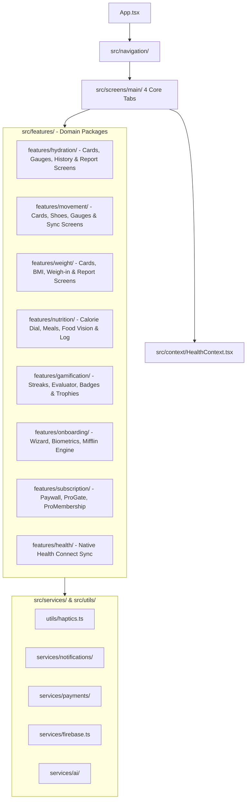

# Calorify — Scalable & Foolproof Architecture Blueprint

> **Status:** Active Reference & Scalable Domain-Driven Blueprint  
> **Branch:** `cmd-v4` (Stable baseline backed up on `v1-stable`)  
> **Framework:** Expo SDK 57 (React Native 0.86, React 19.2, TypeScript 6)  

---

## 1. High-Level System Architecture

Calorify follows a **Domain-Driven & Feature-First Architecture** where business logic, UI components, modals, and detail screens belong to their designated feature packages:
* **`theme/`, `types/`, `context/`**: The core data contracts and styling tokens.
* **`utils/` & `services/`**: Cross-cutting system helpers (Haptics, Notifications, Payments, Firebase, AI).
* **`features/`**: The 4 Health Trackers (**Hydration**, **Movement**, **Weight**, **Nutrition**) + Autonomous Business Engines (**Onboarding**, **Gamification**, **Subscription**, **Health Connect**).
* **`screens/`**: Clean top-level app tabs (`Today`, `Tracker`, `Analytics`, `Profile`) and authentication flows.
* **`components/`**: Shared primitives (`common/`, `charts/`, `navigation/`).



---

## 2. Complete File-by-File Directory Map

Every file in the application is cataloged below with its exact path, current status, and responsibility.

```
src/
│
├── theme/                                      # [THEME TOKENS - Single Source of Truth]
│   ├── colors.ts                               # Primary terracotta (#F47551), slate (#0F172A), semantic macro colors
│   └── typography.ts                           # Kurale (serif), Poppins (headings), Urbanist (metrics) tokens
│
├── types/                                      # [GLOBAL CONTRACTS & DATA MODELS]
│   └── index.ts                                # DailyLog, MealItem, ActivityItem, UserGoals, WeightEntry types
│
├── context/                                    # [GLOBAL STATE & SYNC]
│   └── HealthContext.tsx                       # Single source of truth for daily logs, goals, and Firestore sync
│
├── data/                                       # [STATIC DATA & CATALOGS]
│   ├── foodDatabase.ts                         # Curated offline catalog of 100+ foods with macros
│   └── avatars.ts                              # Curated list of vector avatar options
│
├── assets/                                     # [EMBEDDED METADATA & ASSET MAPS]
│   └── foodImages.ts                           # Static require map for offline food catalog visuals
│
├── hooks/                                      # [APPLICATION HOOKS]
│   └── useRiaDailyInsight.ts                   # Daily AI nutrition coaching insight generator
│
├── utils/                                      # [SYSTEM UTILITIES & TACTILE ENGINE]
│   ├── beverageUtils.tsx                       # Drink icon resolution, standard drink sizes, hydration factors
│   ├── stepHistoryUtils.ts                     # Aggregation math for 7-day, 30-day, and yearly step records
│   └── haptics.ts                              # [TACTILE ENGINE] Centralized Haptic Engine (selection, impact, success, error)
│
├── services/                                   # [EXTERNAL INFRASTRUCTURE & APIS]
│   ├── firebase.ts                             # Firebase Auth instance & Firestore owner-scoped connection
│   │
│   ├── ai/                                     # [RIA AI GEMINI ENGINE]
│   │   ├── AIService.ts                        # Master facade for chat and vision analysis
│   │   ├── config/AIConfig.ts                  # Model parameters (gemini-2.0-flash), temperature, safety thresholds
│   │   ├── context/NutritionContextBuilder.ts  # Injects user goals, weight, and remaining calories into prompts
│   │   ├── errors/AIErrorMapper.ts             # User-friendly translation of rate-limit, network, and quota errors
│   │   ├── gateway/AIRateLimiter.ts            # Sliding-window rate limiter preventing API abuse
│   │   ├── memory/ConversationMemoryManager.ts # Context window budget manager
│   │   ├── memory/GeminiTokenEstimator.ts      # Fast client-side token consumption estimation
│   │   ├── memory/TokenBudgetManager.ts        # Sliding memory trimmer
│   │   ├── observability/AIObservability.ts    # Request latency, token cost, and success metrics
│   │   ├── providers/GeminiProvider.ts         # Direct HTTP REST client to Google Gemini API
│   │   ├── storage/ChatHistoryStorage.ts       # Local chat session caching in AsyncStorage
│   │   ├── storage/SecureKeyStorage.ts         # Encrypted API key storage via expo-secure-store
│   │   ├── types/ai.types.ts                   # ChatMessage, FoodAnalysisResult, AIState interfaces
│   │   ├── validation/AIInputValidator.ts      # Sanitizes prompts and base64 images before transmission
│   │   ├── validation/AIOutputValidator.ts     # Validates and parses structured JSON from food image scans
│   │   └── validation/EdgeImagePreprocessor.ts # Resizes and compresses food photos to <1MB WebP/JPEG
│   │
│   ├── notifications/                          # [HABIT NOTIFICATIONS SCHEDULER]
│   │   ├── index.ts                            # Barrel export
│   │   ├── notificationService.ts              # Native push & local notification permission and trigger client
│   │   └── notificationScheduler.ts            # Logic for Hydration nudges, Meal prompts, and Streak protection
│   │
│   └── payments/                               # [IN-APP PURCHASES & SUBSCRIPTIONS]
│       ├── paymentService.ts                   # StoreKit / Google Play Billing / RevenueCat client
│       └── entitlementManager.ts               # Validates active Pro subscription and gates premium features
│
├── features/                                   # [SELF-CONTAINED DOMAIN MODULES]
│   │
│   ├── hydration/                              # [💧 THE HYDRATION TRACKER DOMAIN]
│   │   ├── index.ts                            # Domain barrel export
│   │   ├── hooks/
│   │   │   └── useHydration.ts                 # Domain hook (intake, goals, quick-add, progress)
│   │   ├── components/
│   │   │   ├── WaterTracker.tsx                # Dashboard quick-stepper intake card (±100ml / ±250ml)
│   │   │   ├── DropletVisualizer.tsx           # Liquid wave physics slosh droplet
│   │   │   ├── HeroDropletCard.tsx             # Detail subscreen summary hero card
│   │   │   ├── WaterGaugeVisualizer.tsx        # 270° radial dial speedometer gauge
│   │   │   ├── WaterHistoryCard.tsx            # Chronological logged drink list with timestamps
│   │   │   └── WaterEntryActionPopover.tsx     # Quick edit / delete popover for water entries
│   │   ├── screens/
│   │   │   ├── WaterTrackerScreen.tsx          # Dedicated hydration subscreen
│   │   │   ├── WaterIntakeHistoryScreen.tsx    # Chronological drink history and custom beverage logger
│   │   │   └── WaterReportScreen.tsx           # Hydration trends, completion %, and beverage breakdown
│   │   └── modals/
│   │       ├── CupSizeModal.tsx                # Standard drink size picker (250ml, 330ml, 500ml)
│   │       ├── DailyWaterGoalModal.tsx         # Daily hydration target setter
│   │       └── HydrationSettingsModal.tsx      # Reminder intervals and container preferences
│   │
│   ├── movement/                               # [👟 THE MOVEMENT & STEPS TRACKER DOMAIN]
│   │   ├── index.ts                            # Domain barrel export
│   │   ├── hooks/
│   │   │   └── useMovement.ts                  # Domain hook (steps, goals, active burn, distance, workouts)
│   │   ├── components/
│   │   │   ├── MovementTrackerCard.tsx         # Dashboard steps, active calorie burn & manual workout logger
│   │   │   ├── HeroStepCard.tsx                # Detail subscreen step summary with km & active duration
│   │   │   ├── StepGaugeVisualizer.tsx         # Circular radial step completion dial
│   │   │   ├── StepHistoryCard.tsx             # Daily step history card with weekly comparison
│   │   │   ├── StepHistoryModal.tsx            # Full-screen historical step inspection drawer
│   │   │   ├── HealthConnectSyncCard.tsx       # Google Health Connect status and manual sync trigger
│   │   │   ├── RunningShoeSvg.tsx              # Vector athletic shoe illustration
│   │   │   ├── StepOutlineIcons.tsx            # Outline vector metric icons
│   │   │   └── StepEntryActionPopover.tsx      # Quick edit / delete popover for activities
│   │   └── screens/
│   │       ├── StepTrackerScreen.tsx           # Dedicated movement subscreen
│   │       └── StepReportScreen.tsx            # Step completion, burn correlation & duration report
│   │
│   ├── health/                                 # [HEALTH CONNECT SYNC ENGINE]
│   │   ├── index.ts                            # Domain barrel export
│   │   ├── healthConnect.ts                    # SDK init & availability
│   │   ├── healthPermissions.ts                # Permission contracts
│   │   ├── healthService.ts                    # 7-day historical backfill & aggregate reader
│   │   └── HealthScreen.tsx                    # Health Connect diagnostics screen
│   │
│   ├── weight/                                 # [⚖️ THE BODY & WEIGHT TRACKER DOMAIN]
│   │   ├── index.ts                            # Domain barrel export
│   │   ├── hooks/
│   │   │   └── useWeight.ts                    # Domain hook (current/target weight, delta, BMI calculation)
│   │   ├── utils/
│   │   │   └── bmiCalculator.ts                # Pure BMI calculation & WHO categorization engine
│   │   ├── components/
│   │   │   ├── WeightTrackerCard.tsx           # Dashboard weigh-in card with goal delta badge
│   │   │   ├── TodayBMICard.tsx                # WHO Clinical BMI zone card (Underweight, Normal, Overweight)
│   │   │   ├── HeroWeightCard.tsx              # Detail screen hero with starting, current & target weight
│   │   │   ├── WeightHistoryCard.tsx           # Chronological weigh-in log with weight change badges
│   │   │   ├── WeightEntryActionPopover.tsx    # Quick edit / delete popover for weigh-ins
│   │   │   └── ClinicalBmiGauge.tsx            # Compact biomarker clinical gauge
│   │   ├── screens/
│   │   │   ├── WeightTrackerScreen.tsx         # Dedicated weight subscreen
│   │   │   ├── WeightHistoryScreen.tsx         # Historical weigh-in log inspection
│   │   │   ├── WeightReportScreen.tsx          # Weight progression trendline & net delta summary
│   │   │   └── LogWeightScreen.tsx             # Full weight logging screen with date picker
│   │   └── modals/
│   │       ├── LogWeightModal.tsx              # Quick weigh-in drawer
│   │       └── WeightGoalSettingsModal.tsx     # Target weight & target milestone date setter
│   │
│   ├── nutrition/                              # [🥗 THE NUTRITION & CALORIE TRACKER DOMAIN]
│   │   ├── index.ts                            # Domain barrel export
│   │   ├── hooks/
│   │   │   └── useNutrition.ts                 # Domain hook (budget, consumed, burned, macros, meal logs)
│   │   ├── components/
│   │   │   ├── HeroCalorieCard.tsx             # Dashboard calorie dial, daily budget & Atwater macro split
│   │   │   ├── MealSection.tsx                 # Breakfast, Lunch, Dinner, Snack collapsible groups
│   │   │   ├── MealCard.tsx                    # Individual meal card with calories & macro pills
│   │   │   ├── CalorieCompletionCard.tsx       # Nutrition report: Daily calorie compliance vs target budget
│   │   │   └── MacroDistributionCard.tsx      # Nutrition report: Protein, Carbs, Fat, Fiber breakdown
│   │   └── modals/
│   │       ├── FoodLogModal.tsx                # Manual food logging drawer with macro calculations
│   │       └── FoodVisionModal.tsx             # 1-Tap AI Camera plate scanner & photo library logger
│   │
│   ├── onboarding/                             # [ONBOARDING WIZARD & BIOMETRICS]
│   │   ├── index.ts                            # Domain barrel export
│   │   ├── screens/
│   │   │   ├── OnboardingWizardScreen.tsx      # Multi-step master orchestrator
│   │   │   ├── AgeSelectionScreen.tsx          # Age selection step
│   │   │   ├── GenderSelectionScreen.tsx       # Gender selection step
│   │   │   ├── GoalSelectionScreen.tsx         # Fitness goal selection step
│   │   │   ├── HeightSelectionScreen.tsx       # Height (cm/ft) selection step
│   │   │   └── WeightSelectionScreen.tsx       # Weight (kg/lbs) selection step
│   │   ├── components/
│   │   │   ├── OnboardingHeader.tsx            # Calori flame brand header with back navigation
│   │   │   ├── PlanCalculationStep.tsx         # Mifflin-St Jeor daily budget & target plan preview
│   │   │   └── PermissionPrimerStep.tsx        # Camera & Health Connect permission primer
│   │   └── services/
│   │       └── onboardingCalculator.ts         # Clinical BMR, TDEE, macro & water target math
│   │
│   ├── gamification/                           # [ACHIEVEMENTS, STREAKS & TROPHIES]
│   │   ├── index.ts                            # Domain barrel export
│   │   ├── engine/
│   │   │   ├── AchievementEvaluator.ts         # Automated audit engine with persistent unlock history
│   │   │   └── achievementRules.ts             # 11 badges across Bronze/Silver/Gold/Diamond tiers
│   │   ├── components/
│   │   │   ├── AchievementBadge.tsx            # Vector badge icon with animated unlocks
│   │   │   ├── StreakFlameBadge.tsx            # Fire streak badge with daily counter
│   │   │   └── CelebrationModal.tsx            # Full-screen celebration dialog on trophy unlock
│   │   └── screens/
│   │       └── AchievementCenterScreen.tsx     # Trophy showcase grid with category filters
│   │
│   └── subscription/                           # [PRO MONETIZATION & FEATURE GATING]
│       ├── index.ts                            # Domain barrel export
│       ├── hooks/
│       │   └── usePro.ts                       # Hook providing `{ isPro, activePlanId, purchasePlan, restorePurchases }`
│       ├── components/
│       │   ├── ProGate.tsx                     # Wrapper locking premium UI for Free tier
│       │   ├── ProBadge.tsx                    # Elegant gold "PRO" tag
│       │   └── ProMembershipCard.tsx           # VIP active membership card vs upgrade CTA
│       └── screens/
│           └── ProPaywallModal.tsx             # Monthly, Annual & Lifetime subscription paywall
│
├── screens/                                    # [TOP-LEVEL NAVIGATION SHELLS]
│   ├── main/
│   │   ├── TodayScreen.tsx                     # Tab 1: Daily diary, HeroCalorieCard, and MealSection
│   │   ├── TrackerScreen.tsx                   # Tab 2: The 4 Health Trackers central dashboard
│   │   ├── AnalyticsScreen.tsx                 # Tab 3: Consolidated weekly/monthly/yearly reports (Pro gated)
│   │   └── ProfileScreen.tsx                   # Tab 4: User settings, Trophy Center & Pro Membership
│   │
│   ├── auth/                                   # [AUTHENTICATION FLOWS]
│   │   ├── WelcomeScreen.tsx                   # App splash / initial landing view (triggers OnboardingWizardScreen)
│   │   ├── SignInScreen.tsx                    # Email & Google Sign-In
│   │   ├── SignUpScreen.tsx                    # Registration flow
│   │   └── ForgotPasswordScreen.tsx            # Password reset email trigger
│   │
│   └── profile/                                # [USER PROFILE SUB-SCREENS]
│       ├── GoalsScreen.tsx                     # Calorie budget, step target, and water goal editor
│       ├── PreferencesScreen.tsx               # Units, haptic toggle, Gemini BYOK, Pro status & notification toggles
│       └── MetabolicSummaryScreen.tsx          # BMR, TDEE, and metabolic breakdown
│
├── components/                                 # [SHARED DESIGN SYSTEM & APP-LEVEL PRIMITIVES]
│   ├── index.ts                                # Clean aggregator re-exporting primitives & domain components
│   ├── common/                                 # Shared primitives (AppLoadingScreen, ErrorBoundary, SlideInSubScreen, UserAvatar)
│   ├── dashboard/                              # TodayScreen primitives (RiaCoachCard, TopDateStrip)
│   ├── modals/                                 # App-level modals (AvatarPickerModal, BYOKSetupModal, NotificationModal, RiaChatModal)
│   ├── navigation/                             # Header and BottomNavBar
│   ├── profile/                                # Profile primitives (ProfileHeaderCard, ProfileMetricInspector, ProfileQuickNavGrid)
│   └── report/                                 # Analytics & chart cards (BMIGaugeCard, ChartTooltipPin, StepCompletionCard, etc.)
│
└── assets/                                     # [LOCAL MEDIA & STATIC ASSETS]
    ├── icons & splash                          # Android adaptive icons, favicon, splash screen, branding logos
    └── media catalogs/                         # Avatar WebPs, offline food catalog images, brand fonts, meal thumbnails
```

---

## 3. The 4 Health Trackers Domain Map

Every one of the 4 Health Trackers now resides in its dedicated, cohesive domain package inside `src/features/`:

| Tracker Domain | Package Location | Domain Hook | Dashboard Card | Detail Subscreen & History | Analytical Reports | Modals |
|---|---|---|---|---|---|---|
| 💧 **Hydration** | `src/features/hydration/` | `useHydration.ts` | `WaterTracker.tsx` | `WaterTrackerScreen.tsx`, `WaterIntakeHistoryScreen.tsx` | `WaterReportScreen.tsx` | `CupSizeModal`, `DailyWaterGoalModal`, `HydrationSettingsModal` |
| 👟 **Movement** | `src/features/movement/` | `useMovement.ts` | `MovementTrackerCard.tsx` | `StepTrackerScreen.tsx`, `HeroStepCard.tsx`, `StepGaugeVisualizer.tsx`, `StepHistoryCard.tsx` | `StepReportScreen.tsx` | `StepHistoryModal`, Health Connect Sync |
| ⚖️ **Weight & Body** | `src/features/weight/` | `useWeight.ts` | `WeightTrackerCard.tsx`, `TodayBMICard.tsx` | `WeightTrackerScreen.tsx`, `WeightHistoryScreen.tsx`, `LogWeightScreen.tsx` | `WeightReportScreen.tsx` | `LogWeightModal`, `WeightGoalSettingsModal` |
| 🥗 **Nutrition** | `src/features/nutrition/` | `useNutrition.ts` | `HeroCalorieCard.tsx`, `MealSection.tsx` | `MealCard.tsx` (in TodayScreen) | `CalorieCompletionCard.tsx`, `MacroDistributionCard.tsx` | `FoodLogModal`, `FoodVisionModal` |

---

## 4. Verification & Testing

Every domain move is continuously verified against:
1. `npx tsc --noEmit` — 0 TypeScript compilation errors.
2. `npm test -- --watchAll=false` — 49/49 passing test suites (273/273 tests green).

