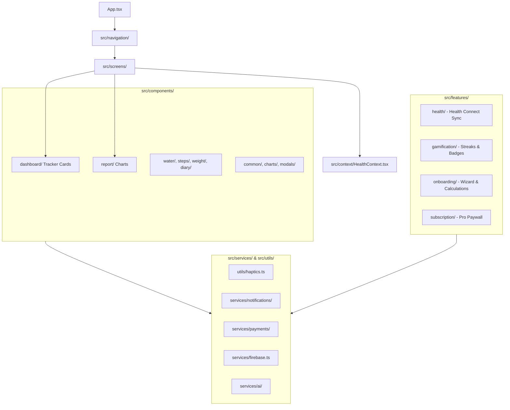

# Calorify — Scalable & Foolproof Architecture Blueprint

> **Status:** Active Reference & Scalable Blueprint  
> **Branch:** `cmd-v4` (Stable baseline backed up on `v1-stable`)  
> **Framework:** Expo SDK 57 (React Native 0.86, React 19.2, TypeScript 6)  

---

## 1. High-Level System Architecture

Calorify is structured so that **every single file has one clear, unambiguous home**:
* **`theme/`, `types/`, `context/`**: The core data contracts and styling tokens.
* **`utils/` & `services/`**: Cross-cutting system helpers (Haptics, Notifications, Payments, Firebase, AI).
* **`components/`**: Reusable visual building blocks, **The 4 Health Trackers**, detail gauges, and report charts.
* **`features/`**: Autonomous business engines (Health Connect, Gamification/Achievements, Onboarding, Subscriptions).
* **`screens/`**: Top-level screen views rendered by navigation.



---

## 2. Complete File-by-File Directory Map

Every file in the application is cataloged below with its exact path, current status, and responsibility.

```
src/
│
├── theme/                                      # [THEME TOKENS - Single Source of Truth]
│   ├── colors.ts                               # Primary terracotta (#F47551), slate (#0F172A), semantic macro colors
│   └── typography.ts                           # Kurale (serif), Poppins (headings), Urbanist (metrics) tokens
│
├── types/                                      # [GLOBAL CONTRACTS & DATA MODELS]
│   └── index.ts                                # DailyLog, MealItem, ActivityItem, UserGoals, WeightEntry types
│
├── context/                                    # [GLOBAL STATE & SYNC]
│   └── HealthContext.tsx                       # Single source of truth for daily logs, goals, and Firestore sync
│
├── utils/                                      # [SYSTEM UTILITIES & TACTILE ENGINE]
│   ├── beverageUtils.tsx                       # Drink icon resolution, standard drink sizes, hydration factors
│   ├── stepHistoryUtils.ts                     # Aggregation math for 7-day, 30-day, and yearly step records
│   └── haptics.ts                              # [NEW] Centralized Haptic Engine (selection, impact, success, error)
│
├── services/                                   # [EXTERNAL INFRASTRUCTURE & APIS]
│   ├── firebase.ts                             # Firebase Auth instance & Firestore owner-scoped connection
│   │
│   ├── ai/                                     # [RIA AI GEMINI ENGINE]
│   │   ├── AIService.ts                        # Master facade for chat and vision analysis
│   │   ├── config/AIConfig.ts                  # Model parameters (gemini-2.0-flash), temperature, safety thresholds
│   │   ├── context/NutritionContextBuilder.ts  # Injects user goals, weight, and remaining calories into prompts
│   │   ├── errors/AIErrorMapper.ts             # User-friendly translation of rate-limit, network, and quota errors
│   │   ├── gateway/AIRateLimiter.ts            # Sliding-window rate limiter preventing API abuse
│   │   ├── memory/ConversationMemoryManager.ts # Context window budget manager
│   │   ├── memory/GeminiTokenEstimator.ts      # Fast client-side token consumption estimation
│   │   ├── memory/TokenBudgetManager.ts        # Sliding memory trimmer
│   │   ├── observability/AIObservability.ts    # Request latency, token cost, and success metrics
│   │   ├── providers/GeminiProvider.ts         # Direct HTTP REST client to Google Gemini API
│   │   ├── storage/ChatHistoryStorage.ts       # Local chat session caching in AsyncStorage
│   │   ├── storage/SecureKeyStorage.ts         # Encrypted API key storage via expo-secure-store
│   │   ├── types/ai.types.ts                   # ChatMessage, FoodAnalysisResult, AIState interfaces
│   │   ├── validation/AIInputValidator.ts      # Sanitizes prompts and base64 images before transmission
│   │   ├── validation/AIOutputValidator.ts     # Validates and parses structured JSON from food image scans
│   │   └── validation/EdgeImagePreprocessor.ts # Resizes and compresses food photos to <1MB WebP/JPEG
│   │
│   ├── notifications/                          # [ACTIVE & TESTED] [NOTIFICATION SCHEDULER]
│   │   ├── index.ts                            # Barrel export
│   │   ├── notificationService.ts              # Native push & local notification permission and trigger client
│   │   └── notificationScheduler.ts            # Logic for Hydration nudges, Meal prompts, and Streak protection
│   │
│   └── payments/                               # [ACTIVE & TESTED] [IN-APP PURCHASES & SUBSCRIPTIONS]
│       ├── paymentService.ts                   # StoreKit / Google Play Billing / RevenueCat client
│       └── entitlementManager.ts               # Validates active Pro subscription and gates premium features
│
├── components/                                 # [REUSABLE UI COMPONENTS & CARDS]
│   │
│   ├── common/                                 # [BASE DESIGN SYSTEM PRIMITIVES]
│   │   ├── AnimatedProgressBar.tsx             # Reanimated smooth progress fill
│   │   ├── AnimatedSvgRing.tsx                 # Smooth circular arc loader / dial
│   │   ├── AppLoadingScreen.tsx                # Splash fallback screen while fonts and auth load
│   │   ├── BouncingDotsLoader.tsx              # Three-dot bounce indicator for Ria AI thinking states
│   │   ├── ConfirmationModal.tsx               # Reusable danger/confirmation alert dialog
│   │   ├── ErrorBoundary.tsx                   # React root crash catcher preventing white-screen crashes
│   │   ├── FoodIconBadge.tsx                   # Category icon badge for meal cards
│   │   ├── FoodImage.tsx                       # expo-image wrapper with caching and placeholder blurhash
│   │   ├── GeminiIcon.tsx                      # Brand sparkle icon for AI features
│   │   ├── MarkdownText.tsx                    # Custom markdown renderer for AI responses
│   │   ├── ScreenTransitionContainer.tsx       # Standard page fade/slide container
│   │   ├── SlideInSubScreen.tsx                # Smooth hardware-accelerated subscreen transition wrapper
│   │   └── UserAvatar.tsx                      # Circular profile avatar with fallback initials
│   │
│   ├── charts/                                 # [SHARED CHART PRIMITIVES]
│   │   ├── ChartTeardropPin.tsx                # Universal vector teardrop pin with white disc and unit label
│   │   ├── ChartTypeToggle.tsx                 # Squircle toggle switching between Bar and Line chart views
│   │   └── chartMath.ts                        # Quadratic bezier corner bar paths (buildBarPath) and Y-axis scales
│   │
│   ├── modals/                                 # [ACTION MODALS & DIALOGS]
│   │   ├── AvatarPickerModal.tsx               # Preset avatar selector
│   │   ├── BYOKSetupModal.tsx                  # "Bring Your Own Key" setup dialog for Gemini API key
│   │   ├── CupSizeModal.tsx                    # Drink container volume picker (250ml, 330ml, 500ml, custom)
│   │   ├── DailyWaterGoalModal.tsx             # Target daily hydration setter
│   │   ├── FoodLogModal.tsx                    # Manual food entry drawer with macro calculators
│   │   ├── FoodVisionModal.tsx                 # Camera viewport for AI food scanning
│   │   ├── HydrationSettingsModal.tsx          # Hydration preferences and reminder times
│   │   ├── LogWeightModal.tsx                  # Weigh-in entry modal with date picker and note
│   │   ├── NotificationModal.tsx               # In-app alert notification viewer
│   │   ├── RiaChatModal.tsx                    # Full-screen conversational AI coach chat interface
│   │   ├── SearchFoodModal.tsx                 # Fast food database search with barcode lookup
│   │   └── WeightGoalSettingsModal.tsx         # Target weight and target date configuration
│   │
│   ├── navigation/                             # [APP NAVIGATION SHELL]
│   │   ├── Header.tsx                          # Top app bar with avatar, streak counter, and notification bell
│   │   └── BottomNavBar.tsx                    # Floating 4-tab bar (Today, Trackers, Analytics, Profile)
│   │
│   ├── dashboard/                              # [THE 4 HEALTH TRACKER CARDS (Dashboard / Today Screen)]
│   │   ├── HeroCalorieCard.tsx                 # 🥗 TRACKER 1: Calorie dial, daily budget, and Atwater macro split
│   │   ├── MealSection.tsx                     # 🥗 TRACKER 1: Breakfast, Lunch, Dinner, Snack collapsible groups
│   │   ├── WaterTracker.tsx                    # 💧 TRACKER 2: Water tracker with ±100ml / ±250ml quick steppers
│   │   ├── MovementTrackerCard.tsx             # 👟 TRACKER 3: Step count, active burn, goal badge, and workout logger
│   │   ├── WeightTrackerCard.tsx               # ⚖️ TRACKER 4: Recent weigh-in, target delta, and quick log button
│   │   ├── TodayBMICard.tsx                    # ⚖️ TRACKER 4: WHO Clinical BMI category gauge (Normal, Overweight, etc.)
│   │   ├── RiaCoachCard.tsx                    # 🤖 AI greeting card with contextual daily insight pills
│   │   └── TopDateStrip.tsx                    # Horizontal interactive 7-day calendar strip
│   │
│   ├── water/                                  # [HYDRATION DETAIL & HISTORY GAUGES]
│   │   ├── DropletVisualizer.tsx               # Real-time liquid wave slosh physics droplet
│   │   ├── HeroDropletCard.tsx                 # Detail screen hero water intake summary
│   │   ├── WaterGaugeVisualizer.tsx            # 270° radial speedometer gauge with center droplet
│   │   ├── WaterHistoryCard.tsx                # Chronological logged drink list with timestamps
│   │   └── WaterEntryActionPopover.tsx         # Quick edit / delete popover for water entries
│   │
│   ├── steps/                                  # [MOVEMENT DETAIL & HISTORY GAUGES]
│   │   ├── HeroStepCard.tsx                    # Detail screen hero step summary with distance & active time
│   │   ├── StepGaugeVisualizer.tsx             # Radial circular step progress gauge
│   │   ├── StepHistoryCard.tsx                 # Daily step history card with weekly comparison
│   │   ├── StepHistoryModal.tsx                # Full-screen historical step inspection drawer
│   │   ├── HealthConnectSyncCard.tsx           # Google Health Connect status and manual sync trigger
│   │   ├── RunningShoeSvg.tsx                  # Custom vector athletic shoe illustration
│   │   ├── StepOutlineIcons.tsx                # Metric outline vector icon set
│   │   └── StepEntryActionPopover.tsx          # Quick edit / delete popover for activity entries
│   │
│   ├── weight/                                 # [WEIGHT DETAIL & HISTORY GAUGES]
│   │   ├── HeroWeightCard.tsx                  # Detail screen weight hero with starting, current, and goal stats
│   │   ├── WeightHistoryCard.tsx               # Chronological weigh-in log with weight change delta badges
│   │   └── WeightEntryActionPopover.tsx        # Quick edit / delete popover for weight entries
│   │
│   ├── diary/                                  # [FOOD LOG DETAIL COMPONENTS]
│   │   └── MealCard.tsx                        # Individual food item card with thumbnail, calories, and macros
│   │
│   ├── profile/                                # [USER PROFILE & METABOLIC COMPONENTS]
│   │   ├── ProfileHeaderCard.tsx               # User avatar, name, and joined milestone banner
│   │   ├── ProfileMetricInspector.tsx          # Quick biomarker grid (Height, Weight, BMI, Activity Level)
│   │   ├── ProfileQuickNavGrid.tsx             # Settings navigation grid (Goals, Preferences, Awards)
│   │   └── ClinicalBmiGauge.tsx                # Compact clinical BMI zone gauge
│   │
│   └── report/                                 # [ALL ANALYTICAL & REPORT CHARTS (Analytics Screen)]
│       ├── CalorieCompletionCard.tsx           # 🥗 Nutrition Report: Daily calorie compliance vs target budget
│       ├── MacroDistributionCard.tsx           # 🥗 Nutrition Report: Protein, Carbs, Fat, Fiber compliance chart
│       ├── StepCompletionCard.tsx              # 👟 Steps Report: Daily step completion vs daily step goal
│       ├── StepCalorieBurnCard.tsx             # 👟 Steps Report: Active calorie burn correlation chart
│       ├── StepTimeDurationCard.tsx            # 👟 Steps Report: Active workout duration chart
│       ├── StepTotalSummaryCard.tsx            # 👟 Steps Report: Total steps, kilometers, and minutes summary
│       ├── DrinkCompletionCard.tsx             # 💧 Water Report: Daily hydration completion percentage chart
│       ├── HydrateVolumeCard.tsx               # 💧 Water Report: Absolute liter volume trend with Line/Bar toggle
│       ├── DrinkTypesCard.tsx                  # 💧 Water Report: SVG Donut breakdown of beverage categories
│       ├── WeightTrendCard.tsx                 # ⚖️ Weight Report: Historical weight progression trendline
│       ├── WeightSummaryCard.tsx               # ⚖️ Weight Report: Net lost / gained delta card
│       ├── BMIGaugeCard.tsx                    # ⚖️ Weight Report: Large clinical BMI gauge with zone markers
│       └── ReportPickerModal.tsx               # 📊 Report Category selector (Nutrition, Steps, Water, Weight)
│
├── features/                                   # [SELF-CONTAINED BUSINESS DOMAINS]
│   │
│   ├── health/                                 # [GOOGLE HEALTH CONNECT SYNC]
│   │   ├── healthConnect.ts                    # Native SDK initialization and availability check
│   │   ├── healthPermissions.ts                # Permission request contract (READ_STEPS, READ_CALORIES)
│   │   ├── healthService.ts                    # 7-day historical backfill and real-time aggregate reader
│   │   └── HealthScreen.tsx                    # Health Connect diagnostics and permission repair screen
│   │
│   ├── onboarding/                             # [ACTIVE & TESTED] [ONBOARDING WIZARD]
│   │   ├── index.ts                            # Barrel export
│   │   ├── screens/OnboardingWizardScreen.tsx  # Multi-step master orchestrator
│   │   ├── components/PermissionPrimerStep.tsx # Pre-permission explainers for Camera & Health Connect
│   │   ├── components/PlanCalculationStep.tsx  # Dynamic Mifflin-St Jeor daily budget calculator
│   │   └── services/onboardingCalculator.ts    # BMR, TDEE, and macro gram formula engine
│   │
│   ├── gamification/                           # [ACTIVE & TESTED] [ACHIEVEMENTS, STREAKS & REWARDS]
│   │   ├── index.ts                            # Barrel export
│   │   ├── engine/AchievementEvaluator.ts      # Automated rule engine that audits logs & unlocks badges
│   │   ├── engine/achievementRules.ts          # Definitions for all badges (7-Day Streak, Water Master, etc.)
│   │   ├── components/AchievementBadge.tsx     # Vector badge icon with Bronze/Silver/Gold/Diamond tiers
│   │   ├── components/StreakFlameBadge.tsx     # Fire streak badge with counter
│   │   ├── components/CelebrationModal.tsx     # Full-screen celebration dialog on badge unlock
│   │   └── screens/AchievementCenterScreen.tsx # Showcase grid of locked and unlocked trophies
│   │
│   └── subscription/                           # [ACTIVE & TESTED] [PRO MONETIZATION & FEATURE GATING]
│       ├── index.ts                            # Barrel export
│       ├── hooks/usePro.ts                     # Hook providing `{ isPro: boolean, activePlanId, purchasePlan, restorePurchases }`
│       ├── components/ProGate.tsx              # Wrapper component that locks UI if user is on Free tier
│       ├── components/ProBadge.tsx             # Elegant gold "PRO" tag for premium UI elements
│       ├── components/ProMembershipCard.tsx    # In-profile active membership / upgrade CTA card
│       └── screens/ProPaywallModal.tsx         # High-converting monthly, annual & lifetime subscription paywall
│
├── screens/                                    # [TOP-LEVEL SCREEN SHELLS]
│   ├── main/
│   │   ├── TodayScreen.tsx                     # Main daily diary and food intake view
│   │   ├── TrackerScreen.tsx                   # Central dashboard hosting all 4 health tracker cards
│   │   ├── AnalyticsScreen.tsx                 # Consolidated weekly/monthly/yearly reports
│   │   ├── ProfileScreen.tsx                   # User settings, preferences, and account management (Integrated with AchievementCenter & ProPaywall)
│   │   ├── WaterTrackerScreen.tsx              # Dedicated hydration subscreen
│   │   ├── StepTrackerScreen.tsx               # Dedicated steps subscreen
│   │   ├── WeightTrackerScreen.tsx             # Dedicated weight subscreen
│   │   ├── WaterIntakeHistoryScreen.tsx        # Hydration history subscreen
│   │   ├── WeightHistoryScreen.tsx             # Weight history subscreen
│   │   ├── LogWeightScreen.tsx                 # Manual weight logging screen
│   │   ├── WaterReportScreen.tsx               # Standalone hydration report view
│   │   ├── StepReportScreen.tsx                # Standalone step report view
│   │   └── WeightReportScreen.tsx              # Standalone weight report view
│   │
│   ├── auth/
│   │   ├── WelcomeScreen.tsx                   # App splash / initial landing view (triggers OnboardingWizardScreen)
│   │   ├── SignInScreen.tsx                    # Email & Google Sign-In
│   │   ├── SignUpScreen.tsx                    # Registration flow
│   │   └── ForgotPasswordScreen.tsx            # Password reset email trigger
│   │
│   └── profile/
│       ├── GoalsScreen.tsx                     # Calorie budget, step target, and water goal editor
│       ├── PreferencesScreen.tsx               # Units, haptic toggle, Gemini BYOK, Pro status & notification toggles
│       ├── MetabolicSummaryScreen.tsx          # BMR, TDEE, and metabolic breakdown
│       └── AwardsScreen.tsx                    # Legacy awards screen (ProfileScreen now uses AchievementCenterScreen)
│
├── data/                                       # [BUNDLED STATIC ASSETS & CATALOGS]
│   ├── foodDatabase.ts                         # Curated offline catalog of 100+ foods with verified macros
│   └── avatars.ts                              # Curated list of vector avatar options
│
└── assets/                                     # [LOCAL IMAGES & STATIC ASSETS]
    ├── adaptive-icon.png                       # Android adaptive foreground icon
    ├── favicon.png                             # Web favicon
    └── splash.png                              # Native boot splash image
```

---

## 3. The 4 Health Trackers Quick Reference

For total clarity, here is how each of the 4 Health Trackers is mapped across the app:

| Tracker Domain | Dashboard Card (`components/dashboard/`) | Detail Subscreen & History (`components/<domain>/`) | Analytical Reports (`components/report/`) |
|---|---|---|---|
| 🥗 **Nutrition Tracker** | `HeroCalorieCard.tsx`, `MealSection.tsx` | `MealCard.tsx` (in `diary/`), `FoodLogModal.tsx` | `CalorieCompletionCard.tsx`, `MacroDistributionCard.tsx` |
| 💧 **Hydration Tracker** | `WaterTracker.tsx` | `WaterGaugeVisualizer.tsx`, `HeroDropletCard.tsx`, `WaterHistoryCard.tsx` | `DrinkCompletionCard.tsx`, `HydrateVolumeCard.tsx`, `DrinkTypesCard.tsx` |
| 👟 **Movement Tracker** | `MovementTrackerCard.tsx` | `HeroStepCard.tsx`, `StepGaugeVisualizer.tsx`, `StepHistoryCard.tsx`, `HealthConnectSyncCard.tsx` | `StepCompletionCard.tsx`, `StepCalorieBurnCard.tsx`, `StepTimeDurationCard.tsx`, `StepTotalSummaryCard.tsx` |
| ⚖️ **Body Tracker** | `WeightTrackerCard.tsx`, `TodayBMICard.tsx` | `HeroWeightCard.tsx`, `WeightHistoryCard.tsx` | `WeightTrendCard.tsx`, `WeightSummaryCard.tsx`, `BMIGaugeCard.tsx` |

---

## 4. The 5 Major Features Status & Implementation Matrix

All 5 major feature modules are implemented, tested, and integrated:

| Feature | Primary Location | Status | Key Files | Integration Points |
|---|---|---|---|---|
| **Haptic Feedback Engine** | `src/utils/` | ✅ Complete (8/8 tests) | `haptics.ts` | `BottomNavBar.tsx`, `AchievementBadge.tsx`, `ProMembershipCard.tsx`, buttons |
| **Onboarding Wizard** | `src/features/onboarding/` | ✅ Complete (12/12 tests) | `OnboardingWizardScreen.tsx`, `onboardingCalculator.ts`, `PermissionPrimerStep.tsx`, `PlanCalculationStep.tsx` | `WelcomeScreen.tsx` |
| **Gamification & Trophies** | `src/features/gamification/` | ✅ Complete (7/7 tests) | `AchievementEvaluator.ts`, `achievementRules.ts`, `CelebrationModal.tsx`, `AchievementBadge.tsx`, `AchievementCenterScreen.tsx` | `ProfileScreen.tsx` (Awards quick-nav action), `BottomNavBar.tsx` |
| **Habit Notifications** | `src/services/notifications/` | ✅ Complete (6/6 tests) | `notificationService.ts`, `notificationScheduler.ts` | `PreferencesScreen.tsx` (Reminders toggle handlers), `App.tsx` (Startup habit sync) |
| **Subscriptions & Paywall** | `src/services/payments/` & `src/features/subscription/` | ✅ Complete (10/10 tests) | `paymentService.ts`, `entitlementManager.ts`, `usePro.ts`, `ProGate.tsx`, `ProPaywallModal.tsx`, `ProMembershipCard.tsx` | `ProfileScreen.tsx` (Pro banner & badge), `PreferencesScreen.tsx`, `AnalyticsScreen.tsx` (Deep Trends gating) |


