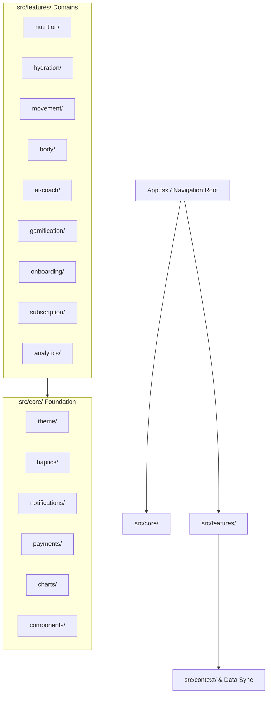

# Calorify — Production Architecture Blueprint

> **Status:** Active Reference & Roadmap  
> **Target Framework:** Expo SDK 57 (React Native 0.86, React 19.2, TypeScript 6)  
> **Architecture Pattern:** Feature-First Vertical Slice Architecture + Shared Core Engine  

---

## 1. Architectural Philosophy & Vision

As Calorify transitions from a simple 3-metric tracker into an all-in-one health, nutrition, and lifestyle platform, the codebase requires an architecture that prevents file sprawl, eliminates duplicate code, and isolates domain logic.

### Core Principles
1. **Vertical Feature Slicing:** Every health domain (Nutrition, Hydration, Movement, Body, AI Coach, Gamification, Subscription) is self-contained. Adding a new feature (e.g. *Sleep* or *Fasting*) creates a single new folder under `src/features/` without polluting existing code.
2. **Strict Domain Isolation:** Modifying Hydration code has **zero risk** of causing regressions in Nutrition or Steps.
3. **Reusable Core Engine (`src/core/`):** Universal primitives (Charts, Haptics, Notifications, Payments, Theme, Base UI) are maintained centrally and shared across all features.
4. **Offline-First & Frictionless:** Supports anonymous guest exploration, local offline persistence, and seamless cloud syncing to Firestore.



---

## 2. Complete Folder Hierarchy & Responsibilities

```
src/
├── core/                         # Cross-Cutting Foundation (Zero business domain logic)
│   ├── theme/                    # Design tokens (Colors, Typography, Spacing, Squircles)
│   ├── haptics/                  # Centralized tactile feedback engine
│   ├── notifications/            # Local push scheduler & trigger rules
│   ├── payments/                 # In-App Purchases, StoreKit/Billing, Entitlement checks
│   ├── charts/                   # Shared Chart Engine (TeardropPin, BarPath, Scales, Toggles)
│   ├── components/               # Pure UI Primitives (Button, Card, Badge, Header, Loaders)
│   └── utils/                    # Generic utilities (date formatting, string helpers)
│
├── features/                     # Self-Contained Business Domains
│   ├── nutrition/                # Food tracking, Calorie balance, Macro compliance
│   ├── hydration/                # Water intake, Beverage categorization, Drink gauge
│   ├── movement/                 # Steps, Workouts, Health Connect sync
│   ├── body/                     # Weight tracking, Target delta, Clinical BMI
│   ├── ai-coach/                 # Ria AI persona, Multimodal vision, Context memory
│   ├── gamification/             # Achievements, Streaks, Badges, Confetti celebrations
│   ├── onboarding/               # Multi-step wizard, Caloric budget calculation, Primers
│   ├── subscription/             # Pro paywall, Feature gating, Plan selector
│   └── analytics/                # Multi-category reporting shell & timeframe aggregators
│
├── context/                      # Global State & Cloud Sync
│   ├── HealthContext.tsx         # Unified health data store
│   └── AuthContext.tsx           # Authentication state & guest mode
│
├── services/                     # External Infrastructure & APIs
│   ├── firebase.ts               # Firebase App, Auth, and Firestore instance
│   └── storage.ts                # AsyncStorage / SecureStore wrappers
│
├── navigation/                   # Top-level Navigators & Transitions
│   ├── AppNavigator.tsx          # Screen router / subscreen coordinator
│   └── BottomNavBar.tsx          # Custom bottom navigation bar
│
└── types/                        # Global shared data contracts
```

---

## 3. Detailed Folder & Module Responsibilities

### 3.1 `src/core/` — The Bedrock Engine

The `core` directory contains code that any feature can import, but `core` **never imports from `features`**.

| Directory | Scope & Responsibility | Key Files |
|---|---|---|
| `core/theme/` | Single source of truth for visual tokens: brand palette, semantic colors, font weights, standard radii. | `colors.ts`, `typography.ts` |
| `core/haptics/` | Unified wrapper over `expo-haptics`. Pre-tuned feedback profiles (`selection`, `light`, `medium`, `heavy`, `success`, `error`). Respects user mute setting. | `haptics.ts`, `hapticProfiles.ts` |
| `core/notifications/` | Local notification scheduling (hydration nudges, meal reminders, streak saver alerts). Handles OS permission requests and badges. | `notificationService.ts`, `notificationScheduler.ts` |
| `core/payments/` | Handles Apple App Store / Google Play In-App Purchases and Subscriptions. Entitlement checks, receipt validation, restore purchases. | `paymentService.ts`, `useSubscription.ts` |
| `core/charts/` | The universal chart kit. Vector teardrop pin (`ChartTeardropPin`), SVG quadratic bar paths (`buildBarPath`), Y-axis scales, squircle bar/line toggle. | `ChartTeardropPin.tsx`, `ChartTypeToggle.tsx`, `chartMath.ts` |
| `core/components/` | Reusable design system primitives: buttons, cards, modals, avatar, screen transition containers, error boundaries. | `Button.tsx`, `Card.tsx`, `UserAvatar.tsx`, `ErrorBoundary.tsx` |

---

### 3.2 `src/features/` — Business Domain Slices

Each feature folder is an autonomous slice containing its own components, screens, hooks, and types.

#### A. `features/nutrition/`
* **Purpose:** Everything food, meal logging, and macronutrient compliance.
* **Components:**
  * `HeroCalorieCard.tsx`: Dashboard hero dial and calorie intake breakdown.
  * `MealSection.tsx`: Breakfast, Lunch, Dinner, Snack group cards.
  * `MealCard.tsx`: Individual meal entry with thumbnail, grams, and macros.
  * `CalorieCompletionCard.tsx`: Weekly/Monthly/Yearly calorie target chart.
  * `MacroDistributionCard.tsx`: Single-macro target compliance chart with dropdown selector.
* **Screens / Modals:** `TodayScreen.tsx`, `FoodLogModal.tsx`, `SearchFoodModal.tsx`.
* **State / Logic:** Food catalog, portion calculators, Atwater caloric ratio logic.

#### B. `features/hydration/`
* **Purpose:** Liquid logging, container presets, beverage classification.
* **Components:**
  * `WaterTrackerCard.tsx`: Dashboard card with quick steppers.
  * `WaterGaugeVisualizer.tsx`: 270° radial speedometer gauge with beveled teardrop.
  * `DropletVisualizer.tsx`: Sloshing liquid wave physics.
  * `WaterHistoryCard.tsx`: Chronological entry log with drink badges.
  * `DrinkCompletionCard.tsx`: Water completion trend chart.
  * `HydrateVolumeCard.tsx`: Liter volume chart with line/bar toggle.
  * `DrinkTypesCard.tsx`: Donut breakdown of beverage categories.
* **Screens / Modals:** `WaterTrackerScreen.tsx`, `CupSizeModal.tsx`, `DailyWaterGoalModal.tsx`, `HydrationSettingsModal.tsx`.

#### C. `features/movement/`
* **Purpose:** Daily steps, physical activities, active energy burn, Google Health Connect.
* **Components:**
  * `MovementTrackerCard.tsx`: Standalone dashboard card with celebration badge and steppers.
  * `HeroStepCard.tsx`: Detail view visualizer with distance and calorie stats.
  * `StepGaugeVisualizer.tsx`: Circular step progression gauge.
  * `StepHistoryCard.tsx`: Activity history list with quick edit/delete.
  * `StepCompletionCard.tsx`: Step completion bar/line chart.
  * `StepCalorieBurnCard.tsx`: Calorie burn correlation chart.
  * `StepTimeDurationCard.tsx`: Active duration chart.
  * `HealthConnectSyncCard.tsx`: Background sync status and manual sync trigger.
* **Screens / Modals:** `StepTrackerScreen.tsx`, `StepHistoryModal.tsx`, Quick workout logger modal.
* **Services:** `healthService.ts` (Google Health Connect reading, aggregate calculation, and 7-day backfill).

#### D. `features/body/`
* **Purpose:** Weight management, weight change velocity, BMI categorization.
* **Components:**
  * `WeightTrackerCard.tsx`: Dashboard tracker with recent weigh-in and goal delta.
  * `HeroWeightCard.tsx`: Weight loss/gain hero summary.
  * `WeightHistoryCard.tsx`: Historical weigh-in timeline with date stamps.
  * `WeightTrendCard.tsx`: Weight progression line/bar chart.
  * `WeightSummaryCard.tsx`: Milestone delta card.
  * `BMIGaugeCard.tsx`: Clinical arc BMI gauge with Underweight/Normal/Overweight zones.
* **Screens / Modals:** `WeightTrackerScreen.tsx`, `WeightHistoryScreen.tsx`, `LogWeightModal.tsx`, `WeightGoalSettingsModal.tsx`.

#### E. `features/ai-coach/`
* **Purpose:** "Ria" AI nutrition coach, meal photo analysis, conversation memory.
* **Components:** `RiaCoachCard.tsx`, `RiaChatModal.tsx`, `FoodVisionModal.tsx`, `BYOKSetupModal.tsx`.
* **Services:**
  * `GeminiProvider.ts`: Multimodal vision and chat API connector.
  * `EdgeImagePreprocessor.ts`: Image compression and base64 preparation.
  * `TokenBudgetManager.ts`: Token consumption estimation and throttling.
  * `AIRateLimiter.ts`: Sliding-window request rate limiter.
  * `ConversationMemoryManager.ts`: User goal context injection.

#### F. `features/gamification/` (Roadmap)
* **Purpose:** User retention, habit reinforcement, milestone celebrations.
* **Submodules:**
  * `engine/AchievementEvaluator.ts`: Background listener that audits daily logs against unlock criteria (e.g. *7-day calorie streak, 3L water milestone, first workout logged*).
  * `components/AchievementBadge.tsx`: Visual badge with locked/unlocked states and tier metal styling (Bronze, Silver, Gold, Platinum).
  * `components/CelebrationModal.tsx`: Confetti particle overlay + celebratory haptic feedback upon unlocking badges.
  * `screens/AwardsScreen.tsx`: Grid of earned and in-progress achievements.

#### G. `features/onboarding/` (Roadmap)
* **Purpose:** Frictionless user introduction, metric collection, plan creation.
* **Screens Flow:**
  1. `WelcomeScreen.tsx`: Brand presentation with "Get Started" and "I already have an account".
  2. `GenderSelectionScreen.tsx`: Biological baseline calculation.
  3. `AgeSelectionScreen.tsx`: Age input with physiological adjustments.
  4. `HeightSelectionScreen.tsx`: Ruler picker (cm/ft).
  5. `WeightSelectionScreen.tsx`: Current weight & target weight wheel.
  6. `GoalSelectionScreen.tsx`: Primary objective (*Lose Weight, Maintain, Build Muscle*).
  7. `PermissionPrimerScreen.tsx`: Explainer screens before native Camera / Health Connect prompts.
  8. `PlanSummaryScreen.tsx`: Generated daily caloric budget and macro targets.

#### H. `features/subscription/` (Roadmap)
* **Purpose:** Monetization, premium feature gating, paywall presentation.
* **Components & Hooks:**
  * `usePro.ts`: Hook returning `{ isPro: boolean, entitlements: string[] }`.
  * `ProGate.tsx`: Component wrapper that locks UI and triggers paywall if not subscribed.
  * `ProPaywallModal.tsx`: High-converting paywall presenting monthly/annual subscription tiers.
  * `RestorePurchasesButton.tsx`: Mandatory App Store restore trigger.

#### I. `features/analytics/`
* **Purpose:** Master reporting hub consolidating reports from all 4 health domains.
* **Components:**
  * `ReportPickerModal.tsx`: Fast dropdown to switch between *Nutrition*, *Steps*, *Water*, and *Weight*.
  * `AnalyticsScreen.tsx`: Orchestrator hosting domain report tabs.

---

## 4. App Store & Production Compliance Architecture

```
Compliance & Legal Checklist (Required Before Launch):
├── In-App Account Deletion: Settings -> Profile -> "Delete Account"
│   └── Action: Wipes Firebase Auth UID + deletes /users/{uid} Firestore collection
├── Terms of Service & Privacy Policy: Accessible from Settings & Onboarding
├── Google Health Connect Privacy Rationale: Dedicated screen in Settings
├── Pre-Permission Primers: Explainers before Camera, Notifs, and Health Connect
└── Restore Purchases: Dedicated button on paywall and settings
```

---

## 5. Phased Refactoring Roadmap

To transition to this architecture cleanly **without breaking existing builds**:

| Phase | Milestone | Goal |
|---|---|---|
| **Phase 1** (Done) | **Safe Pruning** | Pruned dead components (`WorkoutHistoryCard`, `MacroBreakdownCard`, `DailyHabitsCard`) and verified 100% test pass. |
| **Phase 2** (Current) | **Architecture Blueprint** | Published [`ARCHITECTURE.md`](file:///c:/Users/navee/Videos/Calorify/calori/ARCHITECTURE.md) defining the target organization. |
| **Phase 3** | **Core Setup (Charts & Haptics)** | Create `src/core/charts/` (reusable teardrop pin & bar path) and `src/core/haptics/`. |
| **Phase 4** | **Domain Migration** | Organize existing components into `src/features/` with backward-compatible re-exports in `src/components/index.ts`. |
| **Phase 5** | **New Feature Integration** | Implement Gamification Engine, Multi-step Onboarding, Notifications, and Pro Subscription. |
