# Deep Docs Analysis — Calorify Context

> Sources: Android Compose App Bar • RN ScrollView • RN Navigation • RN Animations • RN Gesture Responder • RN Flexbox

---

## 1. 🤖 Android Compose — Display an App Bar

**Source:** [developer.android.com/develop/ui/compose/quick-guides/content/display-app-bar](https://developer.android.com/develop/ui/compose/quick-guides/content/display-app-bar)

### What It Covers
Jetpack Compose's Material 3 `TopAppBar` and `BottomAppBar` components. This is the **Android-native gold standard** for app bar design patterns.

### Key Concepts

| Concept | Android Compose | React Native Equivalent |
|---|---|---|
| `TopAppBar` | Container at top w/ title + nav icon + actions | Custom `View` in header |
| `Scaffold` | Layout host — handles top bar + content area | `SafeAreaView` + manual layout |
| `scrollBehavior` | `enterAlwaysScrollBehavior`, `pinnedScrollBehavior` | `Animated.ScrollView` + `interpolate` |
| `navigationIcon` | Back arrow on the left | `Ionicons name="arrow-back"` |
| `actions` | Right-side icon buttons | `Pressable` with icon on right |
| `EnterAlways` scroll | Bar collapses on scroll down, reappears on scroll up | `scrollY.interpolate` with `outputRange` |
| `Pinned` scroll | Bar stays fixed regardless of scroll | Static `position: 'absolute'` header |
| `ExitUntilCollapsed` | Large title collapses to small on scroll | `titleScale.interpolate` — **already in DiaryScreen!** |

### What This Means for Calorify

Your `DiaryScreen.tsx` already correctly implements the Android `ExitUntilCollapsed` pattern:
```tsx
// DiaryScreen.tsx — already matches Android's ExitUntilCollapsed
const titleScale = scrollY.interpolate({
  inputRange: [0, 50],
  outputRange: [1, 0.78],   // large → compact
  extrapolate: 'clamp',
});
```

For `FoodLogModal`, the header is **pinned** (no scroll behavior on the header itself) — this is the correct pattern since it's a full-screen modal, matching Android's `pinnedScrollBehavior`.

> [!TIP]
> Android's Material 3 design spec says: navigation icon (back arrow) must be **24dp**, placed in a **48dp touch target**. Your current `closeBtn` at 40×40 is slightly below spec — consider bumping to 44×44 (iOS) or 48×48 (Android) for cross-platform correctness.

---

## 2. 📜 RN ScrollView — `using-a-scrollview`

**Source:** [reactnative.dev/docs/using-a-scrollview](https://reactnative.dev/docs/using-a-scrollview)

### What It Covers
`ScrollView` is a **generic scrolling container** that renders ALL its children at once.

### Critical Rules

```
ScrollView renders EVERYTHING upfront — even off-screen items.
FlatList renders only what's visible — uses windowing.
```

| Property | Effect | Used In Calorify? |
|---|---|---|
| `horizontal` | Horizontal scroll | ✅ Category pills, meal tabs |
| `pagingEnabled` | Snaps to page boundaries | ❌ Not used (was Path A) |
| `showsVerticalScrollIndicator={false}` | Hides scrollbar | ✅ Used everywhere |
| `bounces={false}` | Disables iOS rubber-band bounce | ✅ Product detail page |
| `keyboardShouldPersistTaps="handled"` | Tapping list doesn't dismiss keyboard | ✅ Custom form |
| `maximumZoomScale` / `minimumZoomScale` | Pinch-to-zoom (iOS only) | ❌ Not relevant |
| `scrollEventThrottle={16}` | Fires scroll at 60fps | ✅ DiaryScreen |

### When to Use ScrollView vs FlatList

```
ScrollView  →  Small, known list of items (< ~20 items)
             →  Mixed content (images + text + components)
             →  Horizontal carousels (category pills ✅)

FlatList    →  Long data lists (food database = 100+ items ✅)
             →  Performance critical scrolling
             →  `renderItem` for lazy rendering
```

### Calorify Application

Your `FoodLogModal` correctly uses:
- `ScrollView` for the **custom food form** (short, static content) ✅
- `FlatList` for the **food database list** (100+ items) ✅
- Horizontal `ScrollView` for **category pills** ✅

> [!WARNING]
> The **product detail page** uses `ScrollView` with `bounces={false}`. On iOS, the food image uses `contain` fit — if the image is very tall, the non-bouncing scroll can feel unnatural. Consider allowing `bounces={true}` on the product detail scroll.

---

## 3. 🧭 RN Navigation — `navigation`

**Source:** [reactnative.dev/docs/navigation](https://reactnative.dev/docs/navigation)

### What It Covers
React Native has **no built-in navigator**. The official recommended library is **React Navigation** (`@react-navigation/native`).

### React Navigation Architecture

```
NavigationContainer (root)
  └── Stack.Navigator (createNativeStackNavigator)
        ├── HomeScreen
        ├── DiaryScreen       ← your current tab
        ├── ProfileScreen
        └── FoodLogModal      ← currently: React Native <Modal>, NOT a screen
```

### Two Patterns: Modal vs Screen

| Pattern | When to Use | Current Calorify Usage |
|---|---|---|
| `<Modal animationType="slide">` | Quick overlays, short-lived interactions | ✅ FoodLogModal |
| `navigation.navigate('FoodLog')` | Full screens with back stack | ❌ Not used |

### Why Your Current Modal Approach is Correct

The `FoodLogModal` is opened programmatically via `onAddFood(mealType)` — it doesn't need to be in the nav stack because:
- It doesn't need deep linking
- It doesn't need to persist in back-history
- It opens/closes within the same tab context
- The `←` back button just calls `onClose()` — exactly like a modal dismiss

### When You WOULD Switch to Navigation Screen

If you add:
- Deep linking (`calorify://log/breakfast`)
- Native iOS "swipe from left" to go back gesture
- Android hardware back button auto-handling
- Navigation history (go back to food list then diary)

Then `createNativeStackNavigator` would be the right move. For now, `Modal` is correct.

> [!NOTE]
> React Navigation's native stack uses **UINavigationController on iOS** and **Fragment on Android** — meaning you get native hardware back button and swipe-back gesture for FREE. If you eventually migrate FoodLogModal to a proper navigation screen, you'd gain these automatically.

---

## 4. 🎬 RN Animations — `animations`

**Source:** [reactnative.dev/docs/animations](https://reactnative.dev/docs/animations)

### Two Systems

```
Animated API     →  Fine-grained, value-based, composable animations
LayoutAnimation  →  Auto-animate layout changes (add/remove components)
```

### Animated API — Core Concepts

#### Animation Types
| Type | Description | Best For |
|---|---|---|
| `Animated.timing()` | Linear or eased time-based | UI transitions, fades, slides |
| `Animated.spring()` | Physics-based with mass/tension | Bouncy press effects, cards |
| `Animated.decay()` | Velocity-based with friction | Swipe-to-dismiss, throw gestures |

#### Composition Methods
```tsx
Animated.sequence([...])    // play one after another
Animated.parallel([...])    // play all at once
Animated.stagger(delay, [...]) // staggered parallel
Animated.delay(ms)          // pause before next
```

#### Interpolation — Most Powerful Feature
```tsx
const titleScale = scrollY.interpolate({
  inputRange: [0, 50],
  outputRange: [1, 0.78],
  extrapolate: 'clamp',     // don't go beyond outputRange
});
```
Multi-segment interpolation (dead zones):
```tsx
value.interpolate({
  inputRange: [-300, -100, 0, 100, 101],
  outputRange: [300,   0,  1,   0,   0],
});
```

### 🚨 Native Driver — Critical Rule

```tsx
// ✅ CORRECT — runs on UI thread, 60fps guaranteed
Animated.timing(value, {
  toValue: 1,
  useNativeDriver: true,   // ← ALWAYS include this
}).start();
```

**Native driver ONLY supports:**
- `transform` (translateX, translateY, scale, rotate)
- `opacity`

**Native driver CANNOT animate:**
- `width`, `height`, `flex`, `padding`, `margin`, `backgroundColor`

> [!CAUTION]
> In your `DiaryScreen.tsx`, the `scrollY.interpolate` for `titleScale` and `subtitleOpacity` — **verify `useNativeDriver: Platform.OS !== 'web'` is set correctly**. On web, `useNativeDriver` must be `false`.

### Calorify Usage Audit

| Animation | Type | useNativeDriver? | Correct? |
|---|---|---|---|
| `DiaryScreen` title scale | `Animated.event` interpolate | `Platform.OS !== 'web'` | ✅ |
| `FoodLogModal` drawer slide | `Animated.timing` | `Platform.OS !== 'web'` | ✅ |
| `FoodLogModal` toast spring | `Animated.spring` | `Platform.OS !== 'web'` | ✅ |
| `FoodLogModal` toast fade | `Animated.timing` | `Platform.OS !== 'web'` | ✅ |

All animations correctly use the platform check. ✅

### What You Could Add
```tsx
// Spring press feedback on food item cards (feels premium)
const scale = useRef(new Animated.Value(1)).current;

const onPressIn = () => Animated.spring(scale, {
  toValue: 0.96,
  useNativeDriver: true,
  friction: 8,
}).start();

const onPressOut = () => Animated.spring(scale, {
  toValue: 1,
  useNativeDriver: true,
  friction: 8,
}).start();
```

---

## 5. 👆 Gesture Responder System — `gesture-responder-system`

**Source:** [reactnative.dev/docs/gesture-responder-system](https://reactnative.dev/docs/gesture-responder-system)

### What It Covers
The **low-level touch negotiation system** in React Native. Every touch goes through a lifecycle of phases.

### Touch Lifecycle

```
Touch Start
  │
  ├── onStartShouldSetResponder?  (bubbles up from deepest child)
  │     └── true → tries to claim the touch
  │           ├── onResponderGrant  → now responding (highlight!)
  │           └── onResponderReject → someone else has it
  │
  ├── onMoveShouldSetResponder?  (called on every move)
  │     └── true → can steal responder mid-gesture
  │
  ├── onResponderMove    → user is dragging
  ├── onResponderRelease → finger lifted ("touchUp")
  └── onResponderTerminate → OS stole it (Control Center, etc.)
```

### Capture Phase (Parent Priority)

Normally touch bubbles **up** (deepest child wins). To make a **parent** capture the touch before the child:
```tsx
// Parent claims touch BEFORE child gets it
onStartShouldSetResponderCapture: () => true
```

### PanResponder — The Practical API

`PanResponder` wraps the responder system into a higher-level gesture tracking API:
```tsx
const pan = useRef(new Animated.ValueXY()).current;
const panResponder = PanResponder.create({
  onStartShouldSetPanResponder: () => true,
  onPanResponderMove: Animated.event(
    [null, { dx: pan.x, dy: pan.y }],
    { useNativeDriver: false }  // ← must be false for ValueXY
  ),
  onPanResponderRelease: () => {
    Animated.spring(pan, { toValue: { x: 0, y: 0 }, useNativeDriver: false }).start();
  },
});
```

### How This Affects Calorify

The gesture system explains a **real problem you might have noticed**:

```
Problem: Vertical scroll in food list + horizontal scroll in category pills
```

When a user scrolls diagonally:
1. The food `FlatList` has the responder (vertical scroll intent)
2. The category `ScrollView` is horizontal
3. They can conflict!

**Why it works correctly now:** `FlatList` gives up the responder if the gesture is clearly horizontal. React Native's `ScrollView` already handles this negotiation internally.

> [!NOTE]
> The `hitSlop` prop you already use (`HIT_SLOP_8`, `HIT_SLOP_10`) directly extends the touch responder area beyond the visual bounds. This is the correct pattern for small touch targets like the `−` / `+` stepper buttons.

### Best Practice from the Docs

> *"Every action should have feedback (highlight the element) and be cancel-able (drag away to abort)"*

Your `Pressable` components with `pressed ? styles.btnPressedSubtle` already implement this correctly. ✅

---

## 6. 📐 RN Flexbox — `flexbox`

**Source:** [reactnative.dev/docs/flexbox](https://reactnative.dev/docs/flexbox)

### RN Flexbox vs CSS Flexbox — Key Differences

| Property | CSS Default | React Native Default |
|---|---|---|
| `flexDirection` | `row` | **`column`** ← important! |
| `alignContent` | `stretch` | **`flex-start`** |
| `flexShrink` | `1` | **`0`** |
| `flex` | accepts fractions | single number only |

### Core Properties Reference

#### `flex` — Space Distribution
```tsx
// Red = 1/6, Orange = 2/6, Green = 3/6 of available space
<View style={{ flex: 1 }}>     // Red
<View style={{ flex: 2 }}>     // Orange
<View style={{ flex: 3 }}>     // Green
```

#### `flexDirection`
```
column        → children top-to-bottom (DEFAULT in RN)
row           → children left-to-right
column-reverse → bottom-to-top
row-reverse   → right-to-left
```

#### `justifyContent` — Main Axis Alignment
```
flex-start    → pack at start (default)
flex-end      → pack at end
center        → center in main axis
space-between → gaps between items only
space-around  → gaps including half-gap at edges
space-evenly  → equal gaps everywhere
```

#### `alignItems` — Cross Axis Alignment
```
stretch   → fill cross axis width/height (DEFAULT)
flex-start → pack at start of cross axis
flex-end  → pack at end
center    → center in cross axis
baseline  → align text baselines
```

#### `flexBasis` / `flexGrow` / `flexShrink`
```tsx
flexBasis  → initial size before grow/shrink (like width/height)
flexGrow   → how much to EXPAND when there's extra space (0 = don't grow)
flexShrink → how much to SHRINK when there's not enough space (0 = don't shrink, RN default)
```

#### Gap (Modern)
```tsx
gap: 10          // row and column gap
rowGap: 8        // only between rows
columnGap: 12    // only between columns
```

### Calorify Flexbox Patterns Audit

```tsx
// FoodLogModal header — correct 3-column layout:
flexDirection: 'row'          // horizontal
alignItems: 'center'          // vertical center
justifyContent: 'space-between' // left | center | right

// headerTitleCenter — correct centering:
alignItems: 'center'
flex: 1                       // takes remaining space between buttons
marginHorizontal: 8           // breathing room

// Macro strip row — equal columns:
flexDirection: 'row'
gap: 10                       // ✅ modern gap usage
// each macroCol: flex: 1     // equal 33.3% width
```

All flexbox patterns in the current codebase are correct. ✅

> [!TIP]
> **`flexShrink: 0` is the RN default** — this means items DON'T shrink if they overflow. This is why you sometimes need `numberOfLines={1}` + `flex: 1` together: `numberOfLines` truncates text, `flex: 1` prevents the text container from pushing other items off screen.

---

## Summary — How These 6 Docs Apply to Calorify

```mermaid
graph TD
    A[Android App Bar] -->|Pattern reference| B[DiaryScreen Header animation]
    A -->|Back button spec 48dp| C[FoodLogModal ← button]
    D[ScrollView] -->|pagingEnabled not used| E[Meal tabs stay as pills]
    D -->|FlatList for food list| F[FoodLogModal FlatList ✅]
    G[Navigation] -->|Modal pattern confirmed| H[FoodLogModal stays as Modal]
    G -->|Future: nav screen for deep links| I[Future enhancement]
    J[Animations] -->|useNativeDriver critical| K[All anims checked ✅]
    J -->|spring for press feedback| L[Future: food card press spring]
    M[Gesture] -->|hitSlop usage| N[Stepper buttons ✅]
    M -->|Scroll conflict resolution| O[FlatList + category ScrollView ✅]
    P[Flexbox] -->|flex:1 + numberOfLines| Q[Text truncation pattern]
    P -->|gap vs marginRight| R[Modern gap usage ✅]
```



### Action Items

| Priority | Item | File |
|---|---|---|
| 🔴 High | Verify back button touch target is 44×44+ | `FoodLogModal.tsx` |
| 🟡 Med | Add spring press animation to food item cards | `FoodLogModal.tsx` |
| 🟡 Med | Product detail — allow `bounces={true}` | `FoodLogModal.tsx` |
| 🟢 Low | Future: migrate to nav stack for deep linking | App-level |
| 🟢 Low | Stagger animation for category pills on mount | `FoodLogModal.tsx` |
