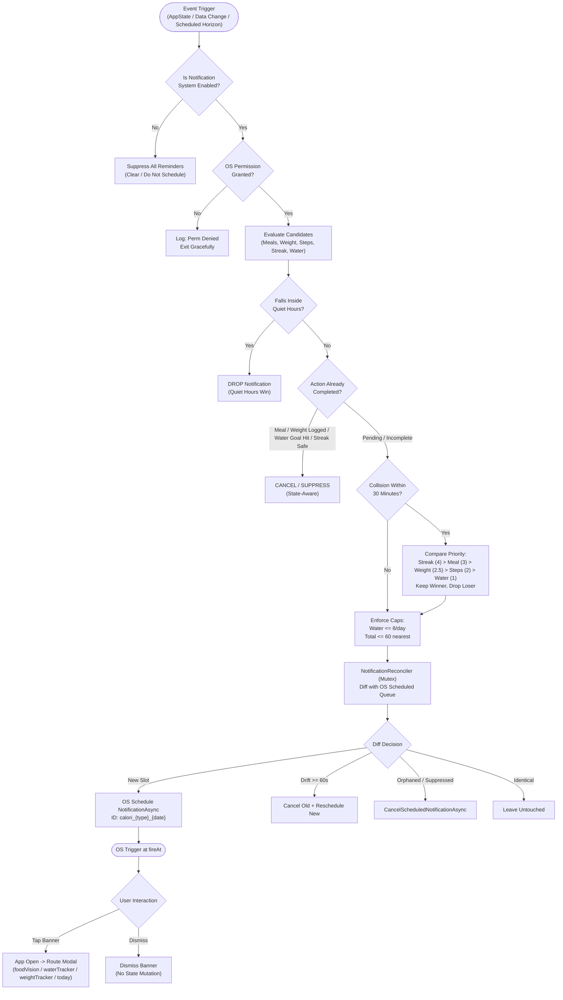
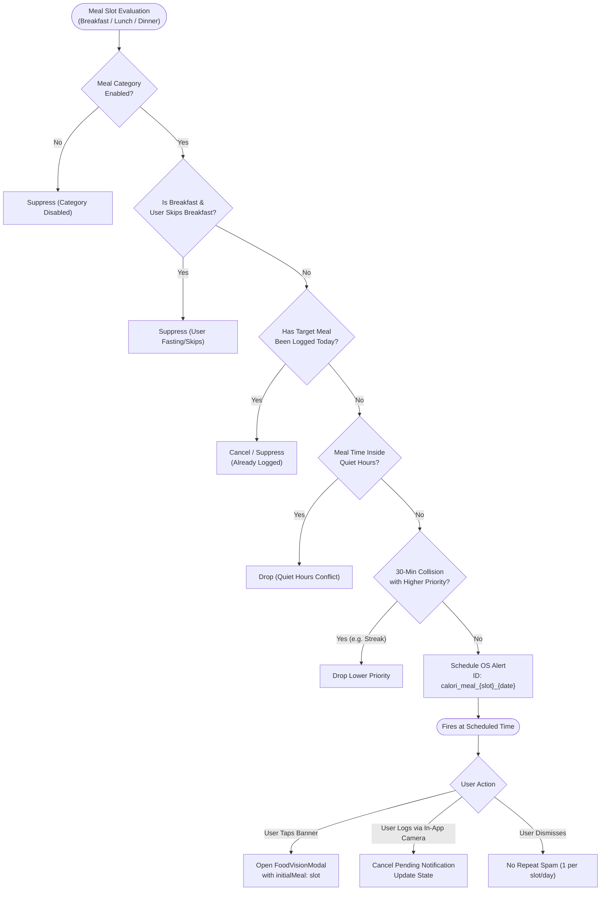
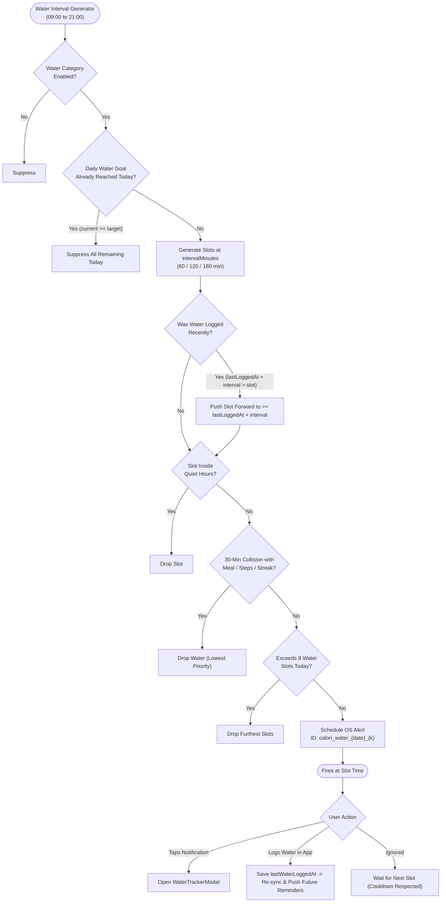
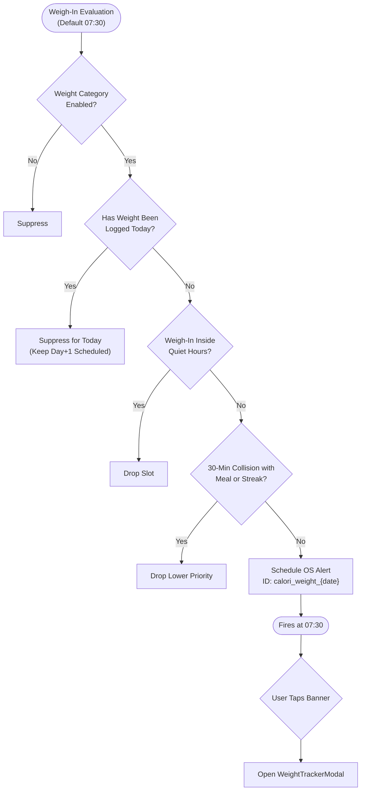
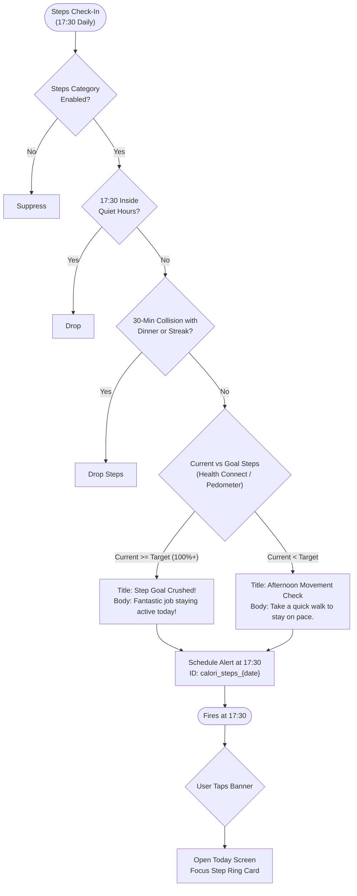
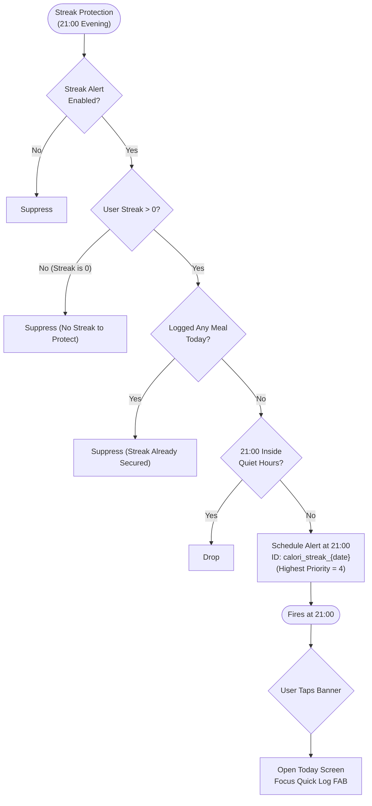
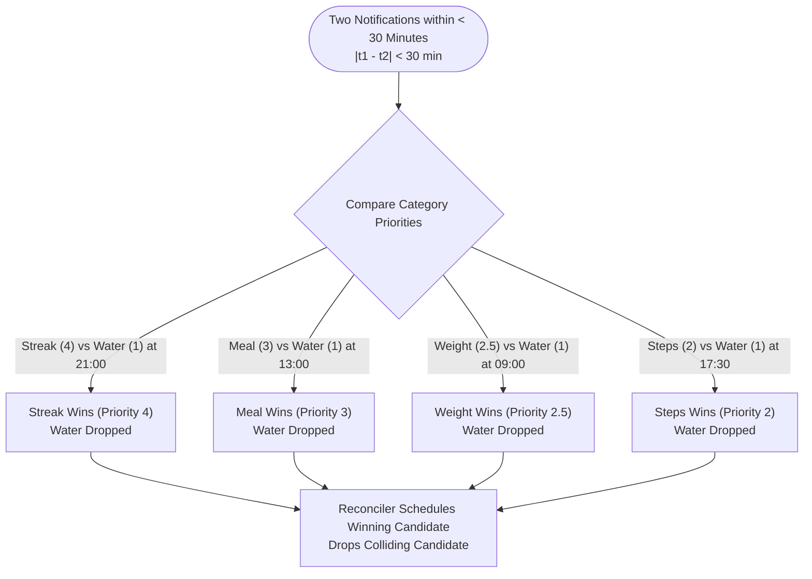

# Calorify: End-to-End Daily Notification Scenario Map & Decision-Tree Specification

> **Document Type:** Production Engineering Specification, Architecture Map & Diagnostic Debugging Reference  
> **Status:** Implemented & Verified in Codebase (37/37 Unit Tests Passing, 0 TypeScript Errors)  
> **Target Framework:** Expo SDK 57 (~57.0.22), React Native 0.86.3, React 19.2, TypeScript ~6.0.3  
> **Scope:** Full-Day Lifecycle (06:00 to 23:00), State-Aware Decision Trees, Conflict Matrices, Failure Recovery, and Observability  

---

## 1. Executive Summary & Architecture

Calorify operates a **State-Aware Planner + Surgical Reconciler Architecture** (`NotificationPlanner` + `NotificationReconciler` + `NotificationStorage`) that replaces legacy static timers with a deterministic, state-aware scheduling engine.

### Core Principles
1. **Deterministic Identity:** Every scheduled OS notification has an immutable logical ID:
   - **Breakfast:** `calori_meal_breakfast_${YYYY-MM-DD}`
   - **Lunch:** `calori_meal_lunch_${YYYY-MM-DD}`
   - **Dinner:** `calori_meal_dinner_${YYYY-MM-DD}`
   - **Hydration:** `calori_water_${YYYY-MM-DD}_${slotIndex}`
   - **Movement:** `calori_steps_${YYYY-MM-DD}`
   - **Streak:** `calori_streak_${YYYY-MM-DD}`
   - **Weight:** `calori_weight_${YYYY-MM-DD}`
2. **Context-Aware State Suppression:**
   - Already logged meals are omitted at plan time.
   - Water reminders are cancelled or suppressed once the daily target ($\text{mL}$) is reached.
   - Next water reminder dynamically respects `lastWaterLoggedAt + intervalMinutes`.
   - Streak alerts are omitted if any meal was logged today or if `streakDays === 0`.
   - Morning weigh-in reminders are omitted for today once weight has been logged.
   - Afternoon step checks celebrate completion if the user has already crushed their step goal.
3. **Quiet Hours Precedence:** Strict drop (not clamp) with midnight wraparound support (default: `22:00` to `07:00`). Triggers falling within quiet hours are dropped permanently, not postponed into the middle of the night.
4. **Collision Window:** 30-minute collision window where higher priority wins:
   $$\text{Streak (4)} > \text{Meals (3)} > \text{Weight (2.5)} > \text{Steps (2)} > \text{Hydration (1)}$$
5. **Surgical Diffing Reconciler:** Diffs pending OS requests against the desired plan via an `AsyncMutex`. Executes targeted cancellations (`toCancel`), additions (`toSchedule`), or updates on time drift $\ge 60\text{s}$ (`toUpdate`) without wiping the entire OS queue.
6. **1-Tap Deep Link Routing:** Tapping a notification opens directly into the target action (`FoodVisionModal` with preselected meal slot, `WaterTrackerModal`, `WeightTrackerModal`, or `TodayScreen`).

---

## 2. Codebase Implementation Inventory

| Category | File Path | Key Functions / Entities | Responsibility |
| :--- | :--- | :--- | :--- |
| **Data Types** | `src/services/notifications/types.ts` | `ReminderType`, `NotificationSettings`, `PlannedNotification`, `SyncNotificationsOptions` | Type contracts for storage, planner outputs, and sync triggers. |
| **Defaults & Map** | `src/services/notifications/defaults.ts` | `DEFAULT_NOTIFICATION_SETTINGS`, `NOTIFICATION_CHANNELS_MAP`, `REMINDER_PRIORITY` | Android channel mappings, default meal hours, and priority rankings. |
| **Persistence** | `src/services/notifications/storage/notificationStorage.ts` | `loadSettings`, `saveSettings`, `updateSettings`, `resetSettings` | Dedicated AsyncStorage (`@calori_notif_settings_v2_${uid}`), decoupled from `UserGoals`. |
| **Pure Planner** | `src/services/notifications/engine/planner.ts` | `planNotifications`, `isInsideQuietHours`, `parseTimeToDate` | Pure functional generator. Computes 7-day meal/weight/step horizon, 2-day water/streak horizon, quiet hours, and 30-min collisions. |
| **Surgical Diffing** | `src/services/notifications/engine/reconciler.ts` | `NotificationReconciler.reconcile`, `AsyncMutex`, `runLegacyMigrationIfNeeded` | Sequentialized diffing (`toCancel`, `toSchedule`, `toUpdate`). Manages `calori_` namespace without full flushes. Emits `notif_reconcile_complete` telemetry. |
| **Facade & Scheduler** | `src/services/notifications/notificationScheduler.ts` | `NotificationScheduler.syncSchedules`, `cancelAllAndReset` | Orchestrator connecting `HealthContext` daily state, settings, and reconciliation. |
| **Service & Permissions**| `src/services/notifications/notificationService.ts` | `initialize`, `requestPermission`, `getPermissionStatus`, `addResponseListener` | Wrapper around native Expo Notifications API and Android channel creation. |
| **Android Channels** | `src/config/notificationChannels.ts` | `setupNotificationChannels`, `NOTIFICATION_CHANNELS` | Android channels: `reminders-meals`, `reminders-water`, `reminders-streak`, `reminders-steps`. |
| **App Lifecycle** | `App.tsx` | `syncNotifications`, `AppState.addEventListener`, `addResponseListener` | Reconciles on `active` foregrounding, data changes, and handles banner tap routing. |
| **Health Context** | `src/context/HealthContext.tsx` | `addWater`, `addMeal`, `updateDailyLog` | Records timestamped entries (`lastWaterLoggedAt`, weight, meals) and triggers notification sync. |
| **Settings UI** | `src/screens/profile/PreferencesScreen.tsx` | `handleToggleMeal`, `handleToggleWeight`, `handleSavePickedTime`, `TimePickerModal` | Reminders UI for custom meal times, weigh-in time, quiet hours, streak, and step alerts. |

---

## 3. Daily User Timeline: 06:00 – 23:00

Default configuration reference:
- **Quiet Hours:** `22:00` – `07:00`
- **Weigh-In:** `07:30` | **Breakfast:** `08:30` | **Lunch:** `13:00` | **Dinner:** `19:30`
- **Water:** Every `120 min` starting at `09:00`
- **Steps:** `17:30` | **Streak:** `21:00`

```
06:00 ─── [QUIET HOURS - SILENCE ENFORCED] ─── 07:00
07:00 ─── Morning Wake Window ────────────────────── 07:30 ── ⚖️ Morning Weigh-In (calori_weight)
                                                     08:30 ── 🍳 Breakfast Reminder (calori_meal_breakfast)
09:00 ─── 💧 Water Slot 0 (calori_water_0) ──────── 11:00 ── 💧 Water Slot 1 (calori_water_1)
12:00 ─── Midday Window ──────────────────────────── 13:00 ── 🥗 Lunch Reminder (calori_meal_lunch) [Water 13:00 dropped]
14:00 ─── Afternoon Pacing ──────────────────────── 15:00 ── 💧 Water Slot 3 (calori_water_3)
17:00 ─── 💧 Water Slot 4 (calori_water_4) ──────── 17:30 ── 🚶 Movement Check / Goal Crushed (calori_steps)
19:00 ─── Evening Window ────────────────────────── 19:30 ── 🍽️ Dinner Reminder (calori_meal_dinner) [Water 19:30 dropped]
21:00 ─── 🔥 Streak Protection (calori_streak) ───── 21:00 [Water 21:00 dropped]
22:00 ─── [QUIET HOURS - SILENCE ENFORCED] ─── 23:00+
```

| Time Block | Period Name | Scheduled Events | Real-World Scenario & State Branching |
| :--- | :--- | :--- | :--- |
| **06:00–07:00** | **Wake-Up & Quiet Hours** | **SILENCE** | • Local time is inside Quiet Hours (`22:00`–`07:00`). All routine notifications are dropped.<br>• If user opens app at 06:15, foreground sync runs. Zero alarms sound immediately. |
| **07:00–08:00** | **Morning Weigh-In** | **07:30:** `calori_weight_${date}` | • **Unlogged:** At 07:30, fires Morning Weigh-In notification.<br>• **Logged at 07:10:** Reconciler has already cancelled `calori_weight_${date}`. Zero notification.<br>• **Quiet Hours conflict:** If user sets weigh-in to 06:30, it is automatically dropped. |
| **08:00–09:00** | **Breakfast Window** | **08:30:** `calori_meal_breakfast_${date}` | • **Unlogged:** At 08:30, fires Breakfast notification.<br>• **Logged at 07:45:** Reconciler has already cancelled `calori_meal_breakfast_${date}`. Zero notification.<br>• **Skip Breakfast:** If `skipsBreakfast: true`, omitted at plan time. |
| **09:00–12:00** | **Morning Hydration** | **09:00:** `calori_water_${date}_0`<br>**11:00:** `calori_water_${date}_1` | • **09:00 Water:** Fires if water intake $< 2000\text{ mL}$.<br>• User drinks 500 mL at 09:15 $\rightarrow$ `lastWaterLoggedAt = 09:15`. Reconciler pushes next reminder to $09:15 + 120\text{ min} = 11:15$.<br>• If goal is reached at 11:30 $\rightarrow$ all remaining water reminders for today are cancelled. |
| **12:00–14:00** | **Lunch Window** | **13:00:** `calori_meal_lunch_${date}` | • **30-Min Collision:** 13:00 Water collides with 13:00 Lunch. Lunch (Priority 3) wins; Water (Priority 1) is dropped.<br>• **Unlogged:** Fires Lunch notification at 13:00.<br>• **Logged at 12:40:** `calori_meal_lunch_${date}` is cancelled before 13:00. |
| **14:00–17:00** | **Afternoon Pacing** | **15:00:** `calori_water_${date}_3`<br>**17:00:** `calori_water_${date}_4` | • Standard hydration pacing.<br>• If user logs water at 16:30 $\rightarrow$ 17:00 reminder is cancelled and shifted to 18:30. |
| **17:00–19:00** | **Afternoon Movement** | **17:30:** `calori_steps_${date}` | • At 17:30, checks `currentSteps` vs `stepGoal`.<br>• **Goal Crushed ($\ge 100\%$):** Fires `🎉 Step Goal Crushed!` celebratory alert.<br>• **Incomplete ($< 100\%$):** Fires `🚶 Afternoon Movement Check` walk prompt. |
| **19:00–21:00** | **Dinner Window** | **19:30:** `calori_meal_dinner_${date}` | • **Unlogged:** Fires Dinner notification at 19:30.<br>• **Logged at 19:10:** `calori_meal_dinner_${date}` is cancelled immediately.<br>• Water at 19:30 is dropped due to collision with Dinner. |
| **21:00–22:00** | **Daily Review & Streak** | **21:00:** `calori_streak_${date}` | • **30-Min Collision:** Streak (Priority 4) beats Water (Priority 1).<br>• **Streak Logic:** If user logged *any* meal today $\rightarrow$ streak is safe; notification is **suppressed**.<br>• If user logged *nothing* all day and streak > 0 $\rightarrow$ Fires warning alert. |
| **22:00–23:00** | **Wind-Down** | **SILENCE** | • Quiet hours begin at 22:00. Any trigger falling after 22:00 is dropped by `isInsideQuietHours`. |
| **23:00+** | **Midnight Rollover** | **SILENCE** | • Pre-scheduled horizon covers Day $D+1$ through $D+6$. When date changes at 00:00, next morning's 07:30 weigh-in and 08:30 breakfast are already registered with OS alarm manager. |

---

## 4. Master Notification Decision Tree



---

## 5. Category-Specific Decision Trees

### 5.1 Meal Reminders (`MEAL-BREAKFAST`, `MEAL-LUNCH`, `MEAL-DINNER`)


### 5.2 Hydration Reminders (`WATER-REMINDER`)


### 5.3 Morning Weigh-In (`WEIGHT-REMINDER`)


### 5.4 Movement & Steps (`STEPS-GOAL`)


### 5.5 Streak Protection (`STREAK-PROTECT`)


---

## 6. Completed vs. Not Completed Scenario Branches

| Branch | Meal Logging (e.g. Lunch at 13:00) | Hydration (e.g. 15:00 Water) | Morning Weigh-In (07:30) |
| :--- | :--- | :--- | :--- |
| **A. Not Completed** | At 13:00, lunch is unlogged. Alert fires: *"Midday meal? Snap a quick photo with Ria AI..."*. | At 15:00, intake is 800 / 2500 mL. Alert fires: *"Time for a fresh glass of water..."*. | At 07:30, weight is unlogged. Alert fires: *"Step on the scale for a quick, consistent check-in..."*. |
| **B. Already Completed** | Lunch logged at 11:30. Reconciler drops `calori_meal_lunch_${date}` from OS queue. Zero notification. | User drank 2600 / 2500 mL at 14:15. Reconciler cancels all remaining today water slots. Zero notification. | Weight logged at 07:10. Reconciler cancels `calori_weight_${date}` for today. Tomorrow remains scheduled. |
| **C. Logged After Scheduling** | Scheduled for 13:00. At 12:40, user snaps food photo. Reconciler immediately cancels `calori_meal_lunch_${date}`. | 15:00 scheduled. User logs 300 mL at 14:40. 15:00 is cancelled; next slot shifts to $14:40 + 120\text{m} = 16:40$. | 07:30 scheduled. User weighs in at 07:20. Reconciler cancels `calori_weight_${date}` before 07:30. |
| **D. Ignored / Dismissed** | User swipes notification away. No repeating nag. Day+1 remains untouched. | User ignores banner. Cooldown is respected; next slot waits for regular interval. | User dismisses banner. No repeat nag. |
| **E. Tapped** | Opens app and displays `FoodVisionModal` with "Lunch" preselected. | Opens app and displays `WaterTrackerModal` with `+250 mL` quick-add buttons. | Opens app and displays `WeightTrackerModal`. |

---

## 7. Tap-to-Action & Navigation Contract

| Notification ID | Route | Parameters | Screen / Modal State | User Recovery on Cancel |
| :--- | :--- | :--- | :--- | :--- |
| `calori_meal_breakfast_${date}` | `'food_vision'` | `{ initialMeal: 'breakfast' }` | Camera viewfinder active; "Breakfast" chip selected. | Dismisses modal $\rightarrow$ returns to `TodayScreen`. |
| `calori_meal_lunch_${date}` | `'food_vision'` | `{ initialMeal: 'lunch' }` | Camera viewfinder active; "Lunch" chip selected. | Dismisses modal $\rightarrow$ returns to `TodayScreen`. |
| `calori_meal_dinner_${date}` | `'food_vision'` | `{ initialMeal: 'dinner' }` | Camera viewfinder active; "Dinner" chip selected. | Dismisses modal $\rightarrow$ returns to `TodayScreen`. |
| `calori_water_${date}_${k}` | `'water'` | `{}` | `WaterTrackerModal` active with intake ring and quick-add buttons. | Dismisses modal $\rightarrow$ returns to active tab. |
| `calori_weight_${date}` | `'weight'` | `{}` | `WeightTrackerModal` active with current weight and goal stepper. | Dismisses modal $\rightarrow$ returns to active tab. |
| `calori_steps_${date}` | `'today'` | `{}` | Navigates to `TodayScreen`, scrolls to Step Ring card. | Remains on `TodayScreen`. |
| `calori_streak_${date}` | `'today'` | `{}` | Navigates to `TodayScreen`, highlights floating `+` FAB and streak flame. | Remains on `TodayScreen`. |

---

## 8. Cross-Category Conflict & Priority Trees

$$\text{Priority Ranking: } \text{Streak Protection (4)} > \text{Meal Reminders (3)} > \text{Morning Weigh-In (2.5)} > \text{Step Checks (2)} > \text{Hydration (1)}$$



---

## 9. Real-World Failure & Recovery Scenarios

- **App Terminated / Cold Start:** Notifications are managed by the OS alarm service. When tapped, the app boots cold, `addResponseListener` intercepts the response payload, and opens the target modal.
- **Offline Operation:** All scheduling is 100% local. Zero network calls or Firebase dependencies required.
- **Device Reboot / OS Battery Killers:** When the user foregrounds the app after a reboot, `AppState -> active` triggers reconciliation, re-establishing all 7-day schedules in $< 150\text{ ms}$.
- **Permission Revoked:** `getPermissionStatus()` detects `status !== 'granted'`. Reconciler exits gracefully without throwing unhandled exceptions.
- **Concurrent Logging Mutex:** If the user logs 3 drinks in rapid succession, `NotificationReconciler`'s `AsyncMutex` queues all calls sequentially, preventing duplicate alarms or corrupted queues.

---

## 10. Stable Scenario IDs & Test Matrix

| Scenario ID | Category | Starting Conditions | Trigger Event | Expected Decision | Expected OS / App Outcome | Verified Test File |
| :--- | :--- | :--- | :--- | :--- | :--- | :--- |
| `MEAL-BRK-001` | Meal | Breakfast unlogged, enabled | Plan 7-day horizon | Schedule at 08:30 | ID: `calori_meal_breakfast_${date}` in OS queue | `planner.test.ts` |
| `MEAL-BRK-002` | Meal | Breakfast already logged today | `addMeal('breakfast')` | Suppress for today | Reconciler issues cancellation for today's breakfast | `reconciler.test.ts` |
| `MEAL-BRK-003` | Meal | `skipsBreakfast: true` | Plan horizon | Suppress completely | No breakfast reminders across entire 7-day horizon | `planner.test.ts` |
| `MEAL-BRK-004` | Meal | Breakfast time set to 06:30 | Plan horizon (Quiet 22:00-07:00) | Drop candidate | Dropped due to quiet hours conflict; UI displays warning | `planner.test.ts` |
| `MEAL-LUN-001` | Meal | Lunch unlogged, enabled | Plan horizon | Schedule at 13:00 | ID: `calori_meal_lunch_${date}` scheduled | `planner.test.ts` |
| `MEAL-LUN-002` | Meal | Lunch scheduled; logged at 12:45 | `addMeal('lunch')` | Cancel pending | `calori_meal_lunch_${date}` cancelled before 13:00 | `reconciler.test.ts` |
| `MEAL-DIN-001` | Meal | Dinner unlogged, enabled | Plan horizon | Schedule at 19:30 | ID: `calori_meal_dinner_${date}` scheduled | `planner.test.ts` |
| `WAT-INT-001` | Water | Water enabled, 120m interval | Plan horizon | Schedule 09:00, 11:00... | 8 slots generated across waking hours | `planner.test.ts` |
| `WAT-INT-002` | Water | Water goal reached (2500/2500) | `addWater(500)` | Suppress today | All remaining today water slots cancelled | `planner.test.ts` |
| `WAT-INT-003` | Water | Water logged at 10:30 | `addWater(250)` | Shift next slot | Next slot postponed to $\ge 12:30$ | `planner.test.ts` |
| `WAT-COL-001` | Water | Water at 13:00 collides with Lunch | Collision check | Drop water | Lunch (Priority 3) scheduled, Water (1) omitted | `planner.test.ts` |
| `WEI-LOG-001` | Weight | Weight enabled, unlogged | Plan horizon | Schedule at 07:30 | ID: `calori_weight_${date}` scheduled | `planner.test.ts` |
| `WEI-LOG-002` | Weight | Weight logged today | Weight logged | Suppress for today | `calori_weight_${date}` cancelled for today; tomorrow kept | `planner.test.ts` |
| `STP-CHK-001` | Steps | Steps enabled, steps < goal | Plan horizon | Schedule at 17:30 | ID: `calori_steps_${date}` with walking prompt | `planner.test.ts` |
| `STP-CEL-001` | Steps | Steps enabled, steps $\ge$ goal | Steps $\ge$ goal | Goal Crushed alert | ID: `calori_steps_${date}` with celebratory copy | `planner.test.ts` |
| `STR-PRO-001` | Streak | Streak = 5, no meal logged today | Plan horizon | Schedule at 21:00 | ID: `calori_streak_${date}` scheduled | `planner.test.ts` |
| `STR-PRO-002` | Streak | Streak = 5, meal already logged | `addMeal('lunch')` | Suppress today | Streak safe; notification omitted | `planner.test.ts` |
| `STR-PRO-003` | Streak | Streak = 0 | Plan horizon | Suppress | Streak = 0; no protection alert needed | `planner.test.ts` |
| `QHT-WRP-001` | Quiet | Quiet 22:00 to 07:00 | Evaluate 23:30 or 06:30 | Drop | `isInsideQuietHours` returns true $\rightarrow$ dropped | `planner.test.ts` |
| `REC-DRF-001` | Reconcile | Scheduled fireAt shifted 2 hours | User changes dinner time | Re-schedule | Reconciler detects drift $\ge 60\text{s}$ $\rightarrow$ updates OS | `reconciler.test.ts` |
| `REC-MUT-001` | Reconcile | Rapid concurrent sync calls | Mutex test | Sequential execution | 0 race conditions, 0 corrupted schedules | `reconciler.test.ts` |

---

## 11. Observability & Telemetry Specification

Diagnostic event schema emitted by `NotificationReconciler` and `Monitoring`:

```json
{
  "eventName": "notif_reconcile_complete",
  "params": {
    "added": 2,
    "removed": 1,
    "updated": 0,
    "untouched": 14
  }
}
```

### Standard Reason Codes (Plan Time Suppression)
- `CATEGORY_DISABLED`: User toggled category off.
- `ALREADY_LOGGED`: Target meal or weigh-in already recorded for today.
- `GOAL_MET`: Water intake target achieved.
- `QUIET_HOURS`: Scheduled time falls in Do Not Disturb period.
- `COLLISION_LOWER_PRIORITY`: Dropped within 30 min of a higher-priority alert.
- `FREQUENCY_CAP`: Hit 8-slot daily water cap or 60-slot global cap.
- `STREAK_ZERO`: Streak is 0; no alert needed.
- `RECENT_ACTIVITY`: Water logged recently; slot postponed.
