<!-- prettier-ignore -->
<div align="center">


# Calorify

[](https://gitdiagram.com/naveencreation/health?utm_source=readme&utm_medium=badge)
[](https://docs.expo.dev/)
[](https://reactnative.dev/)
[](https://www.typescriptlang.org/)
[](https://ai.google.dev/)
[](https://firebase.google.com/)
[](https://docs.swmansion.com/react-native-reanimated/)

> Personal nutrition and holistic wellness tracking built around authentic home-cooked meals and empathetic AI coaching.

[Overview](#overview) • [Features](#features) • [Architecture](#architecture) • [Getting Started](#getting-started) • [Tech Stack](#tech-stack) • [Project Structure](#project-structure)

</div>

---

## Overview

**Calorify** is an offline-first mobile nutrition and wellness application built with **Expo SDK 57**, **React Native 0.86**, and **React 19**. 

Designed with a warm porcelain and sun-terracotta editorial visual language, Calorify focuses on authentic, culturally diverse home-cooked foods (featuring an extensive offline Indian food catalog). It combines daily calorie and Atwater macro budgeting with **Ria**, an AI nutrition coach powered by **Google Gemini 2.0 Flash** for multimodal plate recognition, contextual meal logging, and conversational dietary guidance.

> [!NOTE]
> Calorify is designed to be fully functional offline. Core logging, macro calculations, offline catalogs, and trend histories work seamlessly without an active network connection, synchronizing with Firebase Firestore when connectivity resumes.

---

## Features

### Nutrition and Calorie HUD
- **270-Degree Interactive Dial**: Real-time visualization of daily budget, consumed calories, and burned expenditure (`Eaten`, `Burned`, `Cal left`).
- **Atwater Macro Distribution**: Dedicated progress tracking for Carbohydrates, Protein, and Fat calibrated against personalized goals.
- **7-Day Trend Flip**: One-tap carousel transition to weekly spline curves, average intakes, and daily breakdown points.
- **Daily Meals**: Organized tracking for Breakfast, Lunch, Dinner, and Snacks with fluid portion steppers (`+` / `-`) and instant macro recalculation.
- **Offline Food Catalog**: Curated database of 100+ authentic Indian and global dishes with verified macro profiles and serving sizes.

### Ria AI Nutrition Coach (Gemini 2.0 Flash)
- **Multimodal Food Vision**: Capture photos directly or select from device storage to identify ingredients, portion sizes, and estimated macros.
- **Smart Meal Slotting**: Automatically infers the target meal slot (Breakfast, Lunch, Snacks, Dinner) based on the time of capture.
- **Coaching Conversations**: Empathetic, conversational assistant for meal planning, ingredient swaps, and dietary questions.
- **Bring Your Own Key (BYOK)**: Optional client-side API key configuration encrypted securely on-device with `expo-secure-store`.

### Hydration Tracking
- **Fluid Wave Physics**: Dynamic SVG reservoir reflecting water intake with interactive slosh physics.
- **Beverage Factor Logging**: Rapid logging for diverse drinks with hydration multipliers (Water, Coconut Water, Green Tea, Buttermilk, Milk, Coffee).
- **Intake Timeline**: Hourly distribution metrics to maintain hydration throughout active hours.

### Movement and Activity
- **Radial Step Dial**: 270-degree step goal progress monitor with cadence and calorie burn estimations.
- **Shoe Wear Monitor**: Mileage tracker monitoring athletic shoe degradation to suggest optimal replacement cycles.
- **Android Health Connect**: Background synchronization with native Android sensors and connected wearables.

### Weight and Body Metrics
- **Dual-Ruler Calibration**: Fluid horizontal ruler pickers for current weight and goal targets.
- **Clinical WHO BMI Zones**: Standard diagnostic feedback based on height-to-weight ratios.
- **Timeline Projections**: Mathematical goal date estimations based on chosen weekly deficit or surplus pace.

### Gamification and Habit Building
- **Streak Engine**: Daily flame ignition celebrating consistent logging habits.
- **Achievement Showcase**: Trophy center unlocking badges for milestone achievements.
- **Metabolic Profile**: Detailed inspection of Basal Metabolic Rate (BMR) and Total Daily Energy Expenditure (TDEE).

---

## Architecture

Calorify follows a **Domain-Driven, Feature-First Architecture** where business logic, state reducers, UI components, and sub-screens belong to autonomous domain packages.

```mermaid
%% Generated by https://gitdiagram.com/naveencreation/health
flowchart TD

subgraph group_app["App shell"]
  node_app["App shell<br/>[App.tsx]"]
  node_auth["Authentication"]
  node_onboarding["Onboarding"]
  node_main["Main screens"]
end

subgraph group_tracking["Wellness tracking"]
  node_healthstate["Health context<br/>[HealthContext.tsx]"]
  node_nutrition["Nutrition logging"]
  node_fooddata["Food catalog<br/>[foodDatabase.ts]"]
  node_hydration["Hydration tracking"]
  node_movement["Movement tracking"]
  node_weight["Weight tracking"]
  node_healthintegration["Health Connect"]
  node_analytics["Reports"]
end

subgraph group_engagement["Coaching and goals"]
  node_gamification["Achievements"]
  node_coachui["Ria chat<br/>[RiaChatModal.tsx]"]
  node_insights["Daily insights"]
  node_aiservice["AI service<br/>[AIService.ts]"]
  node_memory["Conversation memory"]
  node_securekeys["Secure key storage"]
  node_gemini["Gemini provider<br/>[GeminiProvider.ts]"]
end

subgraph group_platform["Platform services"]
  node_firebase[("Firebase services<br/>[firebase.ts]")]
  node_payments["Payments<br/>[paymentService.ts]"]
  node_subscription["Pro membership"]
  node_notifications["Notifications"]
end

node_user(("User"))

node_user -->|"opens"| node_app
node_app -->|"routes to"| node_auth
node_app -->|"mounts tabs"| node_main
node_app -->|"reads auth state"| node_healthstate
node_app -->|"schedules"| node_notifications
node_auth -.->|"continues to"| node_onboarding
node_main -.->|"uses shared state"| node_healthstate
node_healthstate -->|"uses"| node_firebase
node_nutrition -->|"reads and updates"| node_healthstate
node_nutrition -.->|"uses catalog"| node_fooddata
node_hydration -->|"reads and updates"| node_healthstate
node_movement -->|"reads and updates"| node_healthstate
node_movement -.->|"offers sync"| node_healthintegration
node_weight -->|"reads and updates"| node_healthstate
node_main -.->|"routes to"| node_analytics
node_coachui -->|"calls"| node_aiservice
node_insights -->|"calls"| node_aiservice
node_aiservice -->|"uses"| node_memory
node_aiservice -->|"uses"| node_securekeys
node_aiservice -->|"dispatches to"| node_gemini
node_memory -->|"syncs chat data"| node_firebase
node_securekeys -->|"accesses user document"| node_firebase
node_subscription -->|"uses"| node_payments
node_gamification -.->|"uses progress data"| node_healthstate

click node_app "https://github.com/naveencreation/health/blob/main/App.tsx"
click node_auth "https://github.com/naveencreation/health/tree/main/src/screens/auth"
click node_onboarding "https://github.com/naveencreation/health/tree/main/src/features/onboarding"
click node_main "https://github.com/naveencreation/health/tree/main/src/screens/main"
click node_healthstate "https://github.com/naveencreation/health/blob/main/src/context/HealthContext.tsx"
click node_nutrition "https://github.com/naveencreation/health/tree/main/src/features/nutrition"
click node_fooddata "https://github.com/naveencreation/health/blob/main/src/data/foodDatabase.ts"
click node_hydration "https://github.com/naveencreation/health/tree/main/src/features/hydration"
click node_movement "https://github.com/naveencreation/health/tree/main/src/features/movement"
click node_weight "https://github.com/naveencreation/health/tree/main/src/features/weight"
click node_healthintegration "https://github.com/naveencreation/health/tree/main/src/features/health"
click node_analytics "https://github.com/naveencreation/health/blob/main/src/screens/main/AnalyticsScreen.tsx"
click node_gamification "https://github.com/naveencreation/health/tree/main/src/features/gamification"
click node_coachui "https://github.com/naveencreation/health/blob/main/src/components/modals/RiaChatModal.tsx"
click node_insights "https://github.com/naveencreation/health/blob/main/src/hooks/useRiaDailyInsight.ts"
click node_aiservice "https://github.com/naveencreation/health/blob/main/src/services/ai/AIService.ts"
click node_memory "https://github.com/naveencreation/health/blob/main/src/services/ai/memory/ConversationMemoryManager.ts"
click node_securekeys "https://github.com/naveencreation/health/blob/main/src/services/ai/storage/SecureKeyStorage.ts"
click node_gemini "https://github.com/naveencreation/health/blob/main/src/services/ai/providers/GeminiProvider.ts"
click node_firebase "https://github.com/naveencreation/health/blob/main/src/services/firebase.ts"
click node_payments "https://github.com/naveencreation/health/blob/main/src/services/payments/paymentService.ts"
click node_subscription "https://github.com/naveencreation/health/tree/main/src/features/subscription"
click node_notifications "https://github.com/naveencreation/health/tree/main/src/services/notifications"

classDef toneNeutral fill:#f8fafc,stroke:#334155,stroke-width:1.5px,color:#0f172a
classDef toneBlue fill:#dbeafe,stroke:#2563eb,stroke-width:1.5px,color:#172554
classDef toneAmber fill:#fef3c7,stroke:#d97706,stroke-width:1.5px,color:#78350f
classDef toneMint fill:#dcfce7,stroke:#16a34a,stroke-width:1.5px,color:#14532d
classDef toneRose fill:#ffe4e6,stroke:#e11d48,stroke-width:1.5px,color:#881337
classDef toneIndigo fill:#e0e7ff,stroke:#4f46e5,stroke-width:1.5px,color:#312e81
classDef toneTeal fill:#ccfbf1,stroke:#0f766e,stroke-width:1.5px,color:#134e4a
class node_app,node_auth,node_onboarding,node_main,node_user toneBlue
class node_healthstate,node_nutrition,node_fooddata,node_hydration,node_movement,node_weight,node_healthintegration,node_analytics toneAmber
class node_gamification,node_coachui,node_insights,node_aiservice,node_memory,node_securekeys,node_gemini toneMint
class node_firebase,node_payments,node_subscription,node_notifications toneRose
```



### Key Architectural Decisions
- **Central State Store**: `HealthContext.tsx` acts as the single source of truth for auth, biometrics, daily logs, and custom foods, caching to AsyncStorage and synchronizing to Firestore.
- **Routerless Architecture**: Uses state-driven tab switching and hardware-accelerated slide-in layers (`SlideInSubScreen`) via Reanimated instead of heavy navigation routers.
- **Hardware-Accelerated UI Motion**: Migrated entirely from legacy React Native `Animated` to `react-native-reanimated` 4.5.1 and worklets for locked 60/120 FPS performance.
- **System Theme Integration**: Fully edge-to-edge on Android with unified `<StatusBar style="dark" />` and `<NavigationBar style="dark" />`.

---

## Tech Stack

| Domain | Technology | Notes |
| :--- | :--- | :--- |
| **Framework** | Expo SDK 57 (`~57.0.22`) | Managed runtime with config plugins |
| **Core** | React Native 0.86 / React 19.2 | Latest concurrent React engine |
| **Language** | TypeScript 6.0 | Strict typechecking across components and models |
| **Animation** | Reanimated 4.5.1 + Worklets | UI-thread transforms (`useSharedValue`, `useAnimatedStyle`) |
| **AI Inference** | Google Gemini 2.0 Flash | Multimodal plate scanning via REST endpoint |
| **Backend** | Firebase Auth & Cloud Firestore | Owner-scoped persistence (`isOwner()`) |
| **Storage** | AsyncStorage + SecureStore | Encrypted credentials and offline disk cache |
| **Health Sensors** | React Native Health Connect | Android Health Connect sensor sync |
| **Rendering** | react-native-svg & expo-image | Vector dial rendering and WebP image pipeline |

---

## Getting Started

### Prerequisites
- [Node.js](https://nodejs.org/) LTS (`v20.x` or later)
- [npm](https://www.npmjs.com/) (`v10+`)
- [Android Studio](https://developer.android.com/studio) (Android emulator / physical device) or Xcode (macOS only)
- [Expo Go](https://expo.dev/go) app on your mobile device for rapid physical testing

### Installation

1. Clone the repository:
   ```bash
   git clone https://github.com/naveencreation/Health.git
   cd Health
   ```

2. Install dependencies:
   ```bash
   npm install
   ```

3. Configure environment variables:
   Create a `.env` file in the project root:
   ```env
   # Google Gemini API Key (optional: can also be configured in-app via BYOK)
   EXPO_PUBLIC_GEMINI_API_KEY=your_gemini_api_key_here

   # Firebase Configuration
   EXPO_PUBLIC_FIREBASE_API_KEY=your_firebase_api_key
   EXPO_PUBLIC_FIREBASE_AUTH_DOMAIN=your_project.firebaseapp.com
   EXPO_PUBLIC_FIREBASE_PROJECT_ID=your_project_id
   EXPO_PUBLIC_FIREBASE_STORAGE_BUCKET=your_project.appspot.com
   EXPO_PUBLIC_FIREBASE_MESSAGING_SENDER_ID=your_sender_id
   EXPO_PUBLIC_FIREBASE_APP_ID=your_app_id
   ```

> [!TIP]
> You can test the application immediately without configuring Firebase credentials by selecting **"Explore as Guest"** on the Welcome screen.

### Running the App

Start the Expo development server:
```bash
npm start
```

In the interactive terminal:
- Press `a` to open in an **Android Emulator** or connected device.
- Press `i` to open in an **iOS Simulator** (macOS only).
- Press `w` to open in a **Web Browser**.
- Scan the terminal QR code with **Expo Go** to run on a physical phone.

---

## Available Scripts

| Command | Description |
| :--- | :--- |
| `npm start` | Starts the Metro bundler with interactive options |
| `npm run web` | Runs the web build on `http://localhost:8081` |
| `npm run android` | Builds and runs on Android emulator or connected device |
| `npm run ios` | Builds and runs on iOS simulator |
| `npx tsc --noEmit` | Validates TypeScript types across the entire project |
| `npm test` | Runs the Jest test suite |
| `npm run lint` | Checks code against ESLint configuration |
| `npm run format` | Automatically formats files using Prettier |

> [!IMPORTANT]
> When verifying changes or adding new features, always run `npx tsc --noEmit` first to ensure there are no TypeScript errors before executing tests.

---

## Project Structure

```plaintext
src/
├── assets/                     # Food catalog image maps and local assets
├── components/                 # Shared UI elements, modals, and screen containers
├── context/                    # HealthContext.tsx (Global state, offline cache, cloud sync)
├── data/                       # Offline food database and avatar datasets
├── features/                   # Domain-specific feature modules
│   ├── gamification/           # Streaks, trophies, milestone evaluators
│   ├── health/                 # Health Connect native synchronization
│   ├── hydration/              # Wave physics, water logger, beverage multipliers
│   ├── movement/               # Step radial dials, shoe wear tracker
│   ├── nutrition/              # Calorie HUD, meal cards, FoodLog modal
│   ├── onboarding/             # 16-step onboarding wizard, Mifflin-St Jeor engine
│   ├── subscription/           # VIP Pro paywall and membership models
│   └── weight/                 # Weight entry rulers, clinical BMI gauges
├── hooks/                      # Custom hooks (Ria AI insights, daily calculators)
├── screens/                    # Core screens (Today, Tracker, Analytics, Profile, Auth)
├── services/                   # External services (Gemini AI, Firebase, Notifications)
├── theme/                      # Styling tokens (Colors and Kurale/Poppins/Urbanist fonts)
├── types/                      # Global TypeScript interfaces and data contracts
└── utils/                      # Haptics engine, step math, beverage utilities
```

---

## Security and Privacy

- **Bring Your Own Key (BYOK)**: User-provided Gemini API keys are never stored in plain text or transmitted through intermediate servers; they are encrypted on the device using `expo-secure-store`.
- **Owner-Scoped Firestore Rules**: Cloud database access is constrained to authenticated resource owners:
  ```javascript
  match /users/{userId}/{document=**} {
    allow read, write: if request.auth != null && request.auth.uid == userId;
  }
  ```
- **Local Data Persistence**: Daily logs and biometrics are stored locally in AsyncStorage and can be exported or purged on sign-out.
