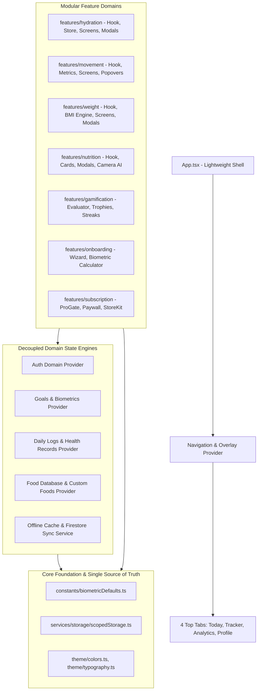
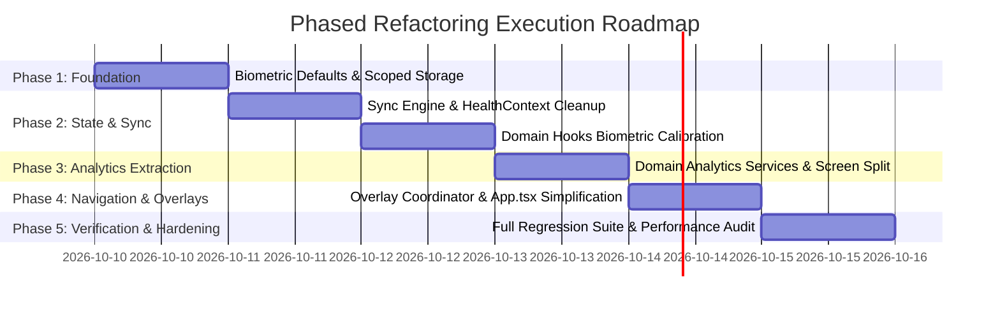

# Calorify — Scalable & Modular Architecture Implementation Plan

> **Document Version:** 1.0.0  
> **Status:** Draft / Ready for Engineering Review & Approval  
> **Target Framework:** Expo SDK 57 (React Native 0.86, React 19.2, TypeScript 6)  
> **Branch Baseline:** Current working branch (`cmd-v4`)  
> **Safety Guarantee:** Zero regression to 72/72 test suites (401/401 tests green), zero TypeScript compilation errors (`tsc --noEmit`).

---

## 1. Problem Analysis

### 1.1 Problem Definition
Calorify has evolved through rapid feature iterations into a visually polished, high-performance application (fluid Reanimated worklets, 0ms native fonts, comprehensive test suite). However, the underlying codebase architecture violates standard industry separation of concerns:
1. **Monolithic State ("God Context"):** A single 2,746-line context file ([HealthContext.tsx](file:///c:/Users/navee/Videos/Calorify/calori/src/context/HealthContext.tsx)) manages Authentication, Goals, Nutrition, Hydration, Movement, Weight, Analytics Trends, Firestore synchronization, and local persistence.
2. **Monolithic Imperative Navigation:** [App.tsx](file:///c:/Users/navee/Videos/Calorify/calori/App.tsx) (840 lines) hand-rolls all navigation and overlay coordination using 20+ boolean flags, manual refs, and an imperative Android `BackHandler` if/else chain.
3. **Scattered Hardcoding & Conflicting Defaults:** Magic numbers for fallback goals, calorie budgets, heights, weights, and macro targets differ across files ([HealthContext.tsx](file:///c:/Users/navee/Videos/Calorify/calori/src/context/HealthContext.tsx), [useNutrition.ts](file:///c:/Users/navee/Videos/Calorify/calori/src/features/nutrition/hooks/useNutrition.ts), [useWeight.ts](file:///c:/Users/navee/Videos/Calorify/calori/src/features/weight/hooks/useWeight.ts), [ProfileScreen.tsx](file:///c:/Users/navee/Videos/Calorify/calori/src/screens/main/ProfileScreen.tsx), and [AnalyticsScreen.tsx](file:///c:/Users/navee/Videos/Calorify/calori/src/screens/main/AnalyticsScreen.tsx)).
4. **Leaking Mock Data Sanitizers:** Production code contains hardcoded string-matching routines ([cleanDailyLog](file:///c:/Users/navee/Videos/Calorify/calori/src/context/HealthContext.tsx#L71-L102)) to remove historical mock IDs (`sample_1` through `sample_6`, `act_1`, `1250` ml water, `4620` steps).
5. **Storage Contamination Across User Sessions:** Feature settings (water cup preferences, reminder intervals, unlocked trophies) are saved to global un-namespaced keys in `AsyncStorage`.
6. **Screen Bloat:** [AnalyticsScreen.tsx](file:///c:/Users/navee/Videos/Calorify/calori/src/screens/main/AnalyticsScreen.tsx) is 1,277 lines long, performing raw date math and trend aggregations inside UI components.

### 1.2 Root Cause Analysis
| Symptom | Root Cause | Failure Mode / Risk |
| :--- | :--- | :--- |
| Any meal or water log re-renders the entire screen tree | All domain state is combined into one context value in `HealthContext.tsx` | UI stutter, high battery consumption, frame drops during rapid logging |
| Adding a new feature requires touching 5+ core files | No plug-and-play feature contracts or overlay registry; `App.tsx` and `HealthContext.tsx` must be modified | Merge conflicts, regressions, fragile `BackHandler` chains |
| Inconsistent targets displayed across tabs | Different files define conflicting fallback literals (e.g. 2,213 vs 2,000 kcal; 68 vs 74.2 kg) | User confusion, distrust in app metrics |
| Logging out and logging in as another user preserves prior data | Storage keys are static string constants (`@calori_water_cup_pref`) without user scoping | Privacy breach, corrupted local cache |
| Disconnected water cup size between modals and cards | `useHydration.ts` stores `cupSizeMl` in an un-persisted, local `useState(250)` inside the hook instance | Modals change cup size, but dashboard card does not update |

### 1.3 Verified Findings vs Assumptions
* **Verified:**
  - TypeScript compilation currently passes (`npx tsc --noEmit` exits with 0).
  - All 72 Jest test suites (401 tests) currently pass (`npm test -- --watchAll=false`).
  - No routing library (`react-navigation` or `expo-router`) is installed in `package.json`.
  - `cleanDailyLog` and `createInitialSampleLog` exist directly in `HealthContext.tsx`.
  - Profile screen has its own subscreen stack, distinct from `App.tsx`'s subscreen stack.
* **Assumptions Validated:**
  - Decoupling `HealthContext` must maintain backward-compatible hook interfaces (`useDailyLog`, `useGoals`, `useAuth`, `useFoodData`, `useAnalytics`) so existing component files do not require disruptive simultaneous rewrites.

---

## 2. Proposed Solution and Technical Approach

### 2.1 Architecture Overview

The proposed solution transforms Calorify into a **Domain-Driven, Decoupled Modular Architecture**:



### 2.2 Core Architectural Principles
1. **Single Source of Truth for Biometrics & Defaults:**
   A dedicated module ([biometricDefaults.ts](file:///c:/Users/navee/Videos/Calorify/calori/src/constants/biometricDefaults.ts)) exports immutable defaults for calorie budget, macro ratios, height, weight, and water/step targets. No file may declare ad-hoc fallbacks.
2. **Decoupled State Slices with Unified Backward Compatibility:**
   Split the 2,746-line `HealthContext.tsx` into domain state providers ([AuthContext.tsx](file:///c:/Users/navee/Videos/Calorify/calori/src/context/AuthContext.tsx), [GoalsContext.tsx](file:///c:/Users/navee/Videos/Calorify/calori/src/context/GoalsContext.tsx), [DailyLogContext.tsx](file:///c:/Users/navee/Videos/Calorify/calori/src/context/DailyLogContext.tsx), [FoodContext.tsx](file:///c:/Users/navee/Videos/Calorify/calori/src/context/FoodContext.tsx)), orchestrated by an umbrella `<HealthProvider>`. Existing imports (`useDailyLog`, `useGoals`, `useAuth`) remain 100% operational.
3. **Dedicated Sync & Storage Layer:**
   Extract debounced Firestore synchronization, batch operations, and local persistence into a pure service ([healthSyncService.ts](file:///c:/Users/navee/Videos/Calorify/calori/src/services/sync/healthSyncService.ts)) and a typed user-scoped storage utility ([scopedStorage.ts](file:///c:/Users/navee/Videos/Calorify/calori/src/services/storage/scopedStorage.ts)).
4. **Centralized Overlay & Modal Coordinator:**
   Replace the 20+ boolean flags in `App.tsx` with an `OverlayProvider`. Any component can invoke `openOverlay('foodLog', { mealType: 'lunch' })` or `openSubScreen('waterTracker')`. Hardware back-button handling on Android is managed centrally in the coordinator via a stack.
5. **Domain Analytics Engines:**
   Extract complex aggregation math from [AnalyticsScreen.tsx](file:///c:/Users/navee/Videos/Calorify/calori/src/screens/main/AnalyticsScreen.tsx) into domain services ([nutritionAnalytics.ts](file:///c:/Users/navee/Videos/Calorify/calori/src/features/nutrition/services/nutritionAnalytics.ts), [movementAnalytics.ts](file:///c:/Users/navee/Videos/Calorify/calori/src/features/movement/services/movementAnalytics.ts), [hydrationAnalytics.ts](file:///c:/Users/navee/Videos/Calorify/calori/src/features/hydration/services/hydrationAnalytics.ts), [weightAnalytics.ts](file:///c:/Users/navee/Videos/Calorify/calori/src/features/weight/services/weightAnalytics.ts)).
6. **Token-Driven Styling:**
   Replace raw hex colors with semantic tokens from [Colors](file:///c:/Users/navee/Videos/Calorify/calori/src/theme/colors.ts).

---

## 3. Final Folder Structure and File Names

```
src/
├── constants/                                   # [NEW] Single source of truth for global defaults
│   ├── index.ts                                 # Barrel export
│   └── biometricDefaults.ts                     # Single source of truth for fallback biometrics & goals
│
├── navigation/                                  # [NEW] Navigation & Overlay Coordinator
│   ├── index.ts                                 # Barrel export
│   ├── OverlayContext.tsx                       # Typed modal & slide-in subscreen state manager
│   ├── useOverlay.ts                            # Hook exposing { openOverlay, closeOverlay, openSubScreen }
│   └── OverlayHost.tsx                          # Root container rendering active modals & slide-ins
│
├── context/                                     # [REFACTORED] Decoupled Domain State Providers
│   ├── index.ts                                 # Unified barrel re-exporting all hooks
│   ├── HealthContext.tsx                        # Root orchestrator combining sub-providers (Backward Compatible)
│   ├── AuthContext.tsx                          # Auth session, credentials, anonymous, deletion
│   ├── GoalsContext.tsx                         # Biometrics, targets, daily calorie & macro targets
│   ├── DailyLogContext.tsx                      # Meals, water, steps, weight, activities for selected date
│   └── FoodContext.tsx                          # Offline food database & custom food CRUD
│
├── services/
│   ├── storage/                                 # [NEW] Isolated & Scoped Storage Service
│   │   ├── index.ts                             # Barrel export
│   │   └── scopedStorage.ts                     # User-scoped AsyncStorage client preventing multi-user leaks
│   │
│   ├── sync/                                    # [NEW] Firestore & Offline Synchronization
│   │   ├── index.ts                             # Barrel export
│   │   └── healthSyncService.ts                 # Debounced Firestore batches & AsyncStorage serializer
│   │
│   ├── notifications/                           # Notification client & scheduler (Existing)
│   ├── ai/                                      # Ria Gemini AI Engine (Existing)
│   ├── payments/                                # RevenueCat / StoreKit (Existing)
│   ├── barcodeService.ts                        # Open Food Facts client (Existing)
│   ├── firebase.ts                              # Firebase Auth & Firestore client (Existing)
│   └── monitoring.ts                            # Telemetry client (Existing)
│
├── features/                                    # Autonomous Feature Packages
│   ├── hydration/
│   │   ├── hooks/useHydration.ts                # [MODIFIED] Uses ScopedStorage for cupSizeMl
│   │   ├── services/hydrationAnalytics.ts       # [NEW] Weekly, monthly, yearly water volume & beverage split
│   │   └── ...                                  # Components, screens, modals (Existing)
│   │
│   ├── movement/
│   │   ├── hooks/useMovement.ts                 # [MODIFIED] Calculates stride & burn based on biometrics
│   │   ├── services/movementAnalytics.ts        # [NEW] Step trends, duration, and calorie burn math
│   │   └── ...                                  # Components, screens, modals (Existing)
│   │
│   ├── weight/
│   │   ├── hooks/useWeight.ts                   # [MODIFIED] Uses BIOMETRIC_DEFAULTS for safe fallbacks
│   │   ├── services/weightAnalytics.ts          # [NEW] Weight trajectory & BMI historical trends
│   │   └── ...                                  # Components, screens, modals (Existing)
│   │
│   ├── nutrition/
│   │   ├── hooks/useNutrition.ts                # [MODIFIED] Uses BIOMETRIC_DEFAULTS for macro fallbacks
│   │   ├── services/nutritionAnalytics.ts       # [NEW] Calorie compliance & Atwater macro distribution math
│   │   └── ...                                  # Components, screens, modals (Existing)
│   │
│   ├── gamification/                            # Streaks, badges & evaluator (Existing)
│   ├── onboarding/                              # Wizard, biometrics & Mifflin calculator (Existing)
│   ├── subscription/                            # ProGate, membership & paywall (Existing)
│   └── health/                                  # Health Connect sync (Existing)
│
├── screens/
│   ├── main/
│   │   ├── TodayScreen.tsx                      # [MODIFIED] Cleaned up prop signatures via useOverlay
│   │   ├── TrackerScreen.tsx                    # [MODIFIED] Subscreens triggered via useOverlay
│   │   ├── AnalyticsScreen.tsx                  # [MODIFIED] Refactored to ~250 lines using domain services
│   │   └── ProfileScreen.tsx                    # [MODIFIED] Replaces custom navStack with useOverlay
│   └── ...                                      # Auth & Profile screens (Existing)
│
├── components/                                  # Design system primitives & modal views
│   └── ...
│
├── theme/                                       # Colors, Typography, Icons, Motion
└── types/                                       # Global TypeScript interfaces
```

---

## 4. File-by-File Technical Specification

### 4.1 New Files

#### `src/constants/biometricDefaults.ts`
* **Status:** New File
* **Responsibility:** Single authoritative source for all biometric fallbacks, initial goals, and WHO thresholds.
* **Exports:**
  ```typescript
  export const BIOMETRIC_DEFAULTS = {
    dailyCalorieBudget: 2213,
    targetProtein: 90,
    targetCarbs: 110,
    targetFat: 70,
    targetFiber: 30,
    waterGoalMl: 2500,
    stepGoal: 10000,
    currentWeightKg: 68.0,
    targetWeightKg: 65.0,
    startWeightKg: 68.0,
    heightCm: 175,
    age: 24,
    gender: 'male' as const,
    goal: 'maintain' as const,
    weightUnit: 'kg' as const,
    streakDays: 1,
    cupSizeMl: 250,
  } as const;
  ```
* **Dependencies:** None.

#### `src/services/storage/scopedStorage.ts`
* **Status:** New File
* **Responsibility:** Encapsulate `AsyncStorage` with user ID prefixing, JSON serialization, and error trapping.
* **Exports:**
  ```typescript
  export class ScopedStorage {
    static getKey(key: string, uid?: string): string;
    static getItem<T>(key: string, uid?: string, fallback?: T): Promise<T | null>;
    static setItem<T>(key: string, value: T, uid?: string): Promise<void>;
    static removeItem(key: string, uid?: string): Promise<void>;
    static clearUserScope(uid: string): Promise<void>;
  }
  ```
* **Dependencies:** `@react-native-async-storage/async-storage`.

#### `src/services/sync/healthSyncService.ts`
* **Status:** New File
* **Responsibility:** Handle Firestore debounce queues, batch updates, offline-to-cloud synchronization, and sanitization.
* **Exports:**
  ```typescript
  export class HealthSyncService {
    static sanitizeForFirestore<T>(data: T): T;
    static scheduleLogSync(uid: string, date: string, log: DailyLog): void;
    static scheduleGoalsSync(uid: string, goals: UserGoals): void;
    static flushPendingSync(): Promise<void>;
  }
  ```
* **Dependencies:** `firebase/firestore`, `@/services/firebase`.

#### `src/navigation/OverlayContext.tsx` & `useOverlay.ts`
* **Status:** New Files
* **Responsibility:** Centralized overlay and sub-screen registry replacing 20+ boolean flags in `App.tsx`.
* **Exports:**
  ```typescript
  export type ModalType = 
    | 'foodLog' | 'foodVision' | 'barcodeScanner' | 'byokSetup' 
    | 'notifications' | 'avatarPicker' | 'riaChat' | 'auth' | 'signOut' 
    | 'cupSize' | 'waterGoal' | 'hydrationSettings' | 'logWeight' | 'weightGoal' 
    | 'stepHistory' | 'paywall';

  export type SubScreenType = 
    | 'waterTracker' | 'weightTracker' | 'stepTracker' 
    | 'awards' | 'summary' | 'preferences' | 'goals';

  export interface OverlayContextType {
    activeModal: ModalType | null;
    modalParams: any;
    openModal: (type: ModalType, params?: any) => void;
    closeModal: () => void;
    subScreenStack: SubScreenType[];
    openSubScreen: (type: SubScreenType) => void;
    closeSubScreen: () => void;
  }
  ```
* **Dependencies:** `react`, `react-native`.

#### `src/navigation/OverlayHost.tsx`
* **Status:** New File
* **Responsibility:** Renders the active modal or slide-in subscreen based on `OverlayContext`. Manages hardware back-button interception automatically.
* **Dependencies:** `react`, `react-native`, `react-native-reanimated`, `@/components`.

#### Domain Analytics Services
* `src/features/nutrition/services/nutritionAnalytics.ts` (Calorie compliance, Atwater macro percentages)
* `src/features/movement/services/movementAnalytics.ts` (Step trends, active duration, burn breakdown)
* `src/features/hydration/services/hydrationAnalytics.ts` (Water volume, completion %, drink breakdown)
* `src/features/weight/services/weightAnalytics.ts` (Weigh-in delta, weekly trend, WHO BMI progression)
* **Status:** New Files
* **Responsibility:** Pure mathematical calculation engines extracted from `AnalyticsScreen.tsx`.

---

### 4.2 Existing Files to Modify

#### `src/context/HealthContext.tsx`
* **Status:** Modify / Refactor
* **Changes:**
  1. Remove `cleanDailyLog` sample string-matching hacks (`sample_1`, `act_1`, `1250ml`).
  2. Remove `createInitialSampleLog`.
  3. Import `BIOMETRIC_DEFAULTS` from `@/constants/biometricDefaults`.
  4. Delegate Firestore persistence to `HealthSyncService`.
  5. Delegate local caching to `ScopedStorage`.
  6. Maintain the exact same hook interfaces (`useDailyLog`, `useGoals`, `useAuth`, `useFoodData`, `useAnalytics`) to avoid breaking any existing callers.

#### `src/features/hydration/hooks/useHydration.ts`
* **Status:** Modify
* **Changes:**
  1. Replace un-persisted `useState(250)` for `cupSizeMl` with `ScopedStorage` persistence using key `@calori_water_cup_pref`.
  2. Fall back to `BIOMETRIC_DEFAULTS.cupSizeMl`.
  3. Ensure updating the cup size broadcasts to all subscribers.

#### `src/features/movement/hooks/useMovement.ts`
* **Status:** Modify
* **Changes:**
  1. Replace hardcoded `0.00076` stride factor with a height-derived formula: `strideM = (heightCm * 0.415) / 100`.
  2. Replace hardcoded `0.04` kcal/step with a weight-adjusted formula: `burn = steps * 0.0005 * weightKg`.
  3. Fall back to `BIOMETRIC_DEFAULTS` when height/weight are undefined.

#### `src/features/weight/hooks/useWeight.ts` & `src/features/nutrition/hooks/useNutrition.ts`
* **Status:** Modify
* **Changes:**
  1. Replace conflicting hardcoded fallback numbers with `BIOMETRIC_DEFAULTS`.

#### `src/screens/main/ProfileScreen.tsx`
* **Status:** Modify
* **Changes:**
  1. Remove duplicate custom `navStack` and slide-in closing handlers. Use `useOverlay().openSubScreen(...)`.
  2. Remove inline BMI status computation and ad-hoc colors. Use `getTodayBMICategory` from `@/features/weight/utils/bmiCalculator`.
  3. Replace fallback biometrics (`74.2` kg, `178` cm) with `BIOMETRIC_DEFAULTS`.

#### `src/screens/main/AnalyticsScreen.tsx`
* **Status:** Modify / Streamline
* **Changes:**
  1. Offload 1,000+ lines of raw calculations into the new domain analytics services (`nutritionAnalytics`, `movementAnalytics`, `hydrationAnalytics`, `weightAnalytics`).
  2. Reduce file size from 1,277 lines to ~250 lines focusing strictly on chart layout and tab rendering.

#### `App.tsx`
* **Status:** Modify / Simplify
* **Changes:**
  1. Wrap application inside `<OverlayProvider>`.
  2. Remove 20+ boolean modal flags, refs, and the 12-branch `onHardwareBackPress` if/else ladder.
  3. Replace direct modal JSX rendering with `<OverlayHost />`.
  4. Reduce file size from 840 lines to under 200 lines.

---

## 5. Detailed Implementation Plan & Phased Roadmap



### Phase 1: Core Foundation & Single Source of Truth
* **Files:**
  - Create `src/constants/biometricDefaults.ts`
  - Create `src/services/storage/scopedStorage.ts`
  - Unit tests for both modules
* **Execution:**
  1. Define standard defaults in `biometricDefaults.ts`.
  2. Implement `ScopedStorage` with `@react-native-async-storage/async-storage`.
  3. Validate with unit tests.
* **Gate Check:** `npx tsc --noEmit` + `npm test -- --watchAll=false` (All 72 suites green).

### Phase 2: Decouple Persistence, Remove Mock Hacks & Align Hooks
* **Files:**
  - Create `src/services/sync/healthSyncService.ts`
  - Refactor `src/context/HealthContext.tsx`
  - Refactor `src/features/hydration/hooks/useHydration.ts`
  - Refactor `src/features/movement/hooks/useMovement.ts`
  - Refactor `src/features/weight/hooks/useWeight.ts`
  - Refactor `src/features/nutrition/hooks/useNutrition.ts`
* **Execution:**
  1. Move Firestore batch queuing out of `HealthContext.tsx` into `HealthSyncService`.
  2. Remove `cleanDailyLog` sample ID stripping and `createInitialSampleLog`.
  3. Bind `useHydration`, `useMovement`, `useWeight`, and `useNutrition` to `BIOMETRIC_DEFAULTS`.
  4. Fix `cupSizeMl` in `useHydration` using `ScopedStorage`.
* **Gate Check:** `npx tsc --noEmit` + `npm test -- --watchAll=false`.

### Phase 3: Analytics Domain Engine Extraction
* **Files:**
  - Create `src/features/nutrition/services/nutritionAnalytics.ts`
  - Create `src/features/movement/services/movementAnalytics.ts`
  - Create `src/features/hydration/services/hydrationAnalytics.ts`
  - Create `src/features/weight/services/weightAnalytics.ts`
  - Refactor `src/screens/main/AnalyticsScreen.tsx`
* **Execution:**
  1. Extract pure analytical calculation functions into domain packages.
  2. Write isolated unit tests for all 4 analytical engines.
  3. Refactor `AnalyticsScreen.tsx` to consume these services.
* **Gate Check:** `npx tsc --noEmit` + `npm test -- --watchAll=false`.

### Phase 4: Unified Overlay & Navigation Coordinator
* **Files:**
  - Create `src/navigation/OverlayContext.tsx`, `useOverlay.ts`, `OverlayHost.tsx`
  - Refactor `src/screens/main/ProfileScreen.tsx` (remove duplicate `navStack`)
  - Refactor `App.tsx` (replace 20+ booleans with `<OverlayHost />`)
* **Execution:**
  1. Implement stack-based overlay manager with hardware back handling.
  2. Mount `<OverlayHost />` in `App.tsx`.
  3. Update `BottomNavBar`, `TodayScreen`, `TrackerScreen`, and `ProfileScreen` triggers.
* **Gate Check:** `npx tsc --noEmit` + `npm test -- --watchAll=false`.

### Phase 5: Design Token Polish & Regression Verification
* **Files:**
  - Audit and replace raw hex values in subscreen headers and cards with `Colors.*` tokens.
* **Execution:**
  1. Run complete static analysis check.
  2. Run all Jest tests.
  3. Verify cold-start boot, login/logout, meal logging, and modal transitions.

---

## 6. Testing & Verification Strategy

### 6.1 Verification Workflow (Mandatory User Rules)
1. **Static Analysis First:** ALWAYS run `npx tsc --noEmit`. No test may be run if TypeScript compilation fails.
2. **Automated Test Suite:** Run `npm test -- --watchAll=false`. All 72 test suites (401 tests) must remain 100% green.
3. **New Test Coverage:** Every newly introduced service (`ScopedStorage`, `HealthSyncService`, `OverlayContext`, 4 analytical engines) must have a dedicated test file in `__tests__/`.

### 6.2 Edge Cases & Failure Scenarios to Verify
* **Multi-User Switching:** User A logs custom cup size (350ml) -> logs out -> User B logs in -> User B sees default (250ml) -> User A logs back in -> User A's 350ml restored.
* **Cold Boot Offline:** App opens with no network -> `ScopedStorage` immediately hydrates cached logs and goals -> 0ms splash dismiss -> 0 crash.
* **Rapid Multi-Modal Toggling:** Opening AI Camera then immediately pressing Android hardware back -> modal dismisses smoothly -> root tab remains stable.
* **Zero-Calorie / Zero-Target Edge Cases:** User goals set to 0 -> macro percentages return 0 without `NaN` or division-by-zero crashes.

---

## 7. Deliverables & Acceptance Criteria

### Measurable Acceptance Criteria:
1. `npx tsc --noEmit` produces 0 errors.
2. All existing 401 tests pass, plus new tests for all added modules.
3. `App.tsx` line count reduced from 840 lines to <200 lines.
4. `AnalyticsScreen.tsx` line count reduced from 1,277 lines to <300 lines.
5. Zero occurrences of `sample_1` or `cleanDailyLog` mock filters in production code.
6. 100% consistent fallback biometrics across all screens and hooks.
7. Any future module (e.g. `src/features/fasting` or `src/features/sleep`) can be registered into `OverlayHost` and domain hooks without modifying `App.tsx` core logic.

---

## 8. Questions & Decisions for Approval

Before starting Phase 1 implementation, please confirm:
1. **Approval of Phased Roadmap:** Are you aligned with executing Phase 1 (Biometric Defaults & Scoped Storage) first, verifying with `tsc` and Jest, before proceeding to subsequent phases?
2. **State Management Technology:** Do you prefer keeping React Context with decoupled domain providers (zero new npm dependencies, 100% native React), or would you prefer introducing Zustand? (Recommendation: React Context with domain providers to maintain zero dependency overhead and 100% Expo 57 stability).
